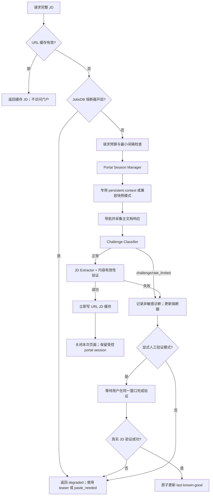

# JobsDB Playwright + Cloudflare 深取恢复与可靠性技术手册

**版本：** 1.0  
**日期：** 2026-08-13  
**适用系统：** `ai-job-search` 的 JobsDB 职位详情页深取流程  
**主要代码：** `tools/fresh_24h/portal_jd_browser.py`、`tools/fresh_24h/two_pass_score.py`  
**目标读者：** 产品线开发者、维护者及负责实施修复的 LLM

---

## 1. 手册目标

本手册解决以下问题：JobsDB 搜索结果页仍可访问，但 Playwright 打开职位详情页时持续进入 Cloudflare Challenge；人工在 headed 浏览器内通过验证后，保存的 `storage_state` 在 headless 会话中仍可能失效；后台启动 headed 浏览器时又因 `stdin` 不是 TTY，只等待约 10 秒便关闭。

本方案的目标不是“保证绕过 Cloudflare”，而是把详情页深取改造成一个：

- 低频、可观察、有请求预算的正常浏览器访问流程；
- 能够在必要时由用户手工完成验证；
- 不会用失败页面污染上一份有效会话；
- 被拦截时会熔断并降级，而不是继续密集重试；
- 可以用确定性测试验证本地逻辑，不依赖反复访问真实 JobsDB；
- 尊重网站条款、robots、访问控制及适用法律。

明确不采用：验证码自动破解、隐匿自动化特征、浏览器指纹伪造、代理池轮换、IP 规避、并发轰炸或其他对抗站点安全控制的方法。

---

## 2. 结论摘要

当前故障不能简单归因于“IP 被封”或“headless 被识别”中的某一个。现有证据更支持三个因素叠加：

1. **访问密度或会话行为触发了更严格的风险控制。** 短时间约五轮扫描后，从偶发 Challenge 变成持续 Challenge，符合请求密度和出口信誉恶化的表现，但尚未通过受控实验确认。
2. **人工验证环境与复用环境不完全一致。** `storage_state` 只保存 cookies、localStorage 等状态，不等于完整浏览器用户目录；headed 与 headless、浏览器特征、资源加载方式及网络出口的差异，都可能使会话再次被评估。
3. **代码中存在确定性的会话管理缺陷。** 这些缺陷即使不是 Cloudflare Challenge 的唯一原因，也会直接降低恢复成功率，必须先修复。

### 2.1 已确认的本地缺陷

| 编号 | 缺陷 | 当前表现 | 必须采取的修复 |
|---|---|---|---|
| C1 | 人工验证与 `sys.stdin.isatty()` 错误耦合 | 后台启动时只能等待 10–15 秒 | 增加显式 `--interactive-verification`，是否等待不得由 TTY 决定 |
| C2 | WAF 失败时也保存状态 | Challenge 页面可能覆盖上一份有效 state | 失败绝不写入 last-known-good；只在真实 JD 验证成功后原子保存 |
| C3 | User-Agent 被硬编码为 Chrome 122 | 实际本机 Chrome 为 151，形成不一致 | 默认不覆盖 UA，使用浏览器自身 UA |
| C4 | Challenge 检测仅靠页面文本 | 可能漏掉标题或正文不典型的 Challenge | 同时读取主文档响应的 `cf-mitigated: challenge`、状态码和 `Retry-After` |
| C5 | “通过验证”的判定过弱 | “标题不是 Just a moment 且 body > 600”可能误判 | 以真实 JD 容器、正文长度、职位语义和非 Challenge 条件联合判定 |
| C6 | 只复用 `storage_state` | 无法保留完整浏览器配置和会话上下文 | 恢复模式优先使用专用 persistent context；state 只作为辅助快照 |
| C7 | 只有 URL 级失败缓存 | 换一个 URL 仍可能继续撞同一门户的风控 | 增加 JobsDB 门户级熔断器和全局请求预算 |
| C8 | 验证时仍阻止 image/font/media | 人工验证和后续访问环境存在额外差异 | 验证与恢复阶段不拦资源；稳定后只采用保守、可测试的资源策略 |
| C9 | 保存失败被静默吞掉 | 用户可能误以为会话已成功保存 | 保存失败必须返回结构化错误并记录不含敏感值的诊断信息 |

### 2.2 尚未证实、必须通过实验区分的假设

| 优先级 | 假设 | 可证伪预测 |
|---|---|---|
| H1 | 原直连出口受到临时的 IP/行为级限制 | 同一时间、同一浏览器模式下，合法替代网络使用独立新会话可访问，而原出口仍被拦 |
| H2 | headless 环境导致会话被重新挑战 | 同一出口、同一专用 profile，headed 成功但 headless 稳定失败 |
| H3 | `storage_state` 不足以延续验证会话 | 同一出口下，persistent context 成功，而把 cookies 导入全新 context 失败 |
| H4 | JobsDB 对详情页设置了比列表页更严格的规则 | 同一会话和出口下列表页始终成功、不同详情页一致 Challenge |

在完成第 12 节的受控测试前，产品和日志只能写“疑似出口/行为风险”或“疑似浏览器上下文不连续”，不能写成已确认根因。

---

## 3. 官方机制与设计约束

Cloudflare 官方说明：通过 Challenge 后会设置 `cf_clearance`；默认 Challenge Passage 为 30 分钟、推荐 15–45 分钟，但具体时长由网站配置，而且 Challenge Passage **不适用于 rate limiting rules**。因此“cookie 尚未到期”不等于“不再受到限流或重新挑战”。

`cf_clearance` 与特定访客和设备相关，且相关信任可依据会话行为持续重新评估。验证码在一个网络出口完成、后续请求换到另一个出口，也可能形成验证循环。

Cloudflare Challenge 页面响应可通过 `cf-mitigated: challenge` 判断；不能只依赖页面标题、HTTP 200 或正文长度。

Playwright 的 `storage_state` 主要保存 cookies、localStorage，并可选择保存 IndexedDB；它不是完整 Chrome profile。需要最大限度保持上下文连续时，应使用 `launch_persistent_context(user_data_dir=...)`，并使用专门的自动化目录，不能直接操作用户日常 Chrome 主 profile。

上述机制直接产生四项架构约束：

1. 验证、保存和后续访问必须保持同一网络出口、浏览器 channel、profile 与资源策略。
2. `cf_clearance` 的存在或 expires 字段只能说明 cookie 存在，不能作为访问成功的验收条件。
3. 真正的成功条件是目标 JobsDB 详情页已加载出可提取的真实 JD。
4. 系统必须在 Challenge 或限流发生时停止加压，并允许走缓存、teaser 或人工粘贴 JD 的降级路径。

---

## 4. 目标架构



### 4.1 模块职责

| 模块 | 单一职责 |
|---|---|
| `PortalSessionManager` | 创建、锁定、复用和关闭 JobsDB 专用浏览器 profile |
| `ChallengeClassifier` | 根据响应头、状态码、正文标记和页面结构分类 |
| `VerificationCoordinator` | 在显式模式下等待人工验证，不依赖 stdin |
| `JdContentValidator` | 判断页面是否为真实职位详情，而非 Challenge 或通用壳页面 |
| `LastKnownGoodStore` | 原子保存有效快照、manifest 与备份；拒绝失败状态 |
| `PortalCircuitBreaker` | 跨 URL 统计门户失败，暂停继续访问 |
| `PortalRequestBudget` | 控制单次扫描数量、并发、间隔和重试 |
| `DiagnosticRecorder` | 输出不含 cookie/代理凭据的结构化诊断记录 |

第一版实施可以仍保留在 `portal_jd_browser.py` 内，但类和数据契约应独立；如果文件继续膨胀，再拆成 `portal_session.py`、`portal_challenge.py` 和 `portal_circuit.py`。

---

## 5. 标准状态机

### 5.1 状态

| 状态 | 含义 |
|---|---|
| `CACHE_HIT` | 已从 URL 缓存取得有效 JD |
| `READY` | 熔断器关闭、预算允许、会话可用 |
| `FETCHING` | 正在打开详情页 |
| `CHALLENGED` | 检测到 Challenge 页面 |
| `RATE_LIMITED` | HTTP 429 或明确的限流信号 |
| `WAITING_HUMAN` | 明确进入人工验证等待 |
| `VERIFYING_CONTENT` | 验证页面是否已经是实际 JD |
| `SUCCESS` | 提取并验证出完整 JD |
| `RETRY_WAIT` | 根据可重试策略短暂等待 |
| `CIRCUIT_OPEN` | 门户级熔断，停止详情访问 |
| `DEGRADED` | 使用 teaser、已有缓存或请求用户粘贴 |
| `FAILED` | 非重试错误或超时结束 |

### 5.2 强制转移规则

1. `CHALLENGED` 不得直接转为 `SUCCESS`；必须经过 `VERIFYING_CONTENT`。
2. `CHALLENGED`、`RATE_LIMITED`、`FAILED` 不得写入 last-known-good state。
3. 只有 `VERIFYING_CONTENT → SUCCESS` 才可更新 session manifest 和 storage snapshot。
4. `RATE_LIMITED` 若有 `Retry-After`，必须优先采用该值；不得提前重试。
5. 连续 Challenge 达到阈值后，所有不同 JobsDB URL 都进入 `CIRCUIT_OPEN`，避免 URL 轮换绕过失败缓存。
6. 熔断时扫描仍可继续处理其他门户和列表页结果，但 JD 深度必须标记为 `teaser` 或 `paste_needed`，不得冒充 full JD。

---

## 6. 浏览器会话设计

### 6.1 推荐模式

按优先级使用：

1. **恢复模式：headed + persistent context。** 用户在专用窗口完成验证，随后由同一 profile、同一出口继续低频访问。
2. **稳定运行模式：经受控验证后决定 headed 或 headless。** 如果 headless 复测持续失败，JobsDB 详情页保持 headed，不强求 headless。
3. **兼容模式：普通 context + storage_state。** 仅作为现有调用方的过渡方案，不作为验证恢复的首选。

### 6.2 专用 profile

建议目录：

```text
~/.config/jobsearch/browser_profiles/jobsdb/
├── user-data/                 # Playwright persistent user data
├── session_manifest.json     # 非敏感会话元数据
├── storage_state_lkg.json    # 辅助快照，last known good
├── storage_state_lkg.bak.json
└── profile.lock              # 防止并发启动同一 profile
```

要求：

- 目录权限 `0700`，state 文件权限 `0600`；
- 路径必须位于用户 home 内，不得进入仓库、Tracker 或调试附件；
- 禁止两个进程同时打开同一 `user-data`；
- 禁止使用用户日常 Chrome profile；
- proxy 凭据、cookie 值和 authorization header 不得写进日志或 manifest。

### 6.3 User-Agent 与浏览器版本

删除当前硬编码的 Chrome 122 UA。默认让实际浏览器生成 UA：

```python
context_kwargs = {
    "locale": "en-HK",
    "viewport": {"width": 1280, "height": 900},
}
# 不设置 user_agent
```

启动后记录浏览器版本和 `navigator.userAgent` 用于诊断，但不得基于它做伪装。若 Playwright 的 `channel="chrome"` 不可用而回退到 bundled Chromium，必须把实际 channel 和版本写进 result，不能无提示回退。

### 6.4 资源加载策略

- `WAITING_HUMAN` 和首次恢复后的验证访问：加载全部正常页面资源。
- 普通已稳定会话：第一版仍建议不拦截资源，先获得稳定基线。
- 若未来为性能重新阻止 media 或大图片，必须以单变量 A/B 测试证明不会增加 Challenge；字体和脚本不得拦截。

---

## 7. 后台人工验证的正确实现

### 7.1 CLI 契约

新增参数：

```text
--headed
--interactive-verification
--verification-timeout-seconds 600
--user-data-dir ~/.config/jobsearch/browser_profiles/jobsdb/user-data
--verification-signal-file ~/.config/jobsearch/browser_profiles/jobsdb/recheck.signal
--save-storage-state ~/.config/jobsearch/browser_profiles/jobsdb/storage_state_lkg.json
--diagnostics-dir ~/.config/jobsearch/diagnostics/jobsdb
```

规则：

- `--interactive-verification` 是唯一决定是否长期等待用户的开关；
- `stdin.isatty()` 只可决定是否显示“按 Enter”交互，不得决定等待时间；
- `--headed` 没有与 `--interactive-verification` 同时出现时，应按普通 bounded fetch 运行；
- headless 与 `--interactive-verification` 同时出现时应直接参数错误；
- 默认人工验证超时建议 600 秒；超时后返回 `verification_timeout`，不保存失败状态；
- signal file 只表示“请立即重新检查页面”，不能直接代表验证成功。

### 7.2 等待算法

```python
deadline = monotonic() + verification_timeout
while monotonic() < deadline:
    observation = observe_page(page, last_main_response)

    if validator.is_real_jd(observation):
        return VERIFIED

    if browser_or_page_closed(page):
        return USER_CANCELLED

    if signal_file.exists():
        signal_file.unlink()
        # 仅触发一次立即复查

    page.wait_for_timeout(1000)

return VERIFICATION_TIMEOUT
```

用户不需要让后台进程持有 TTY。只要浏览器窗口仍在，脚本便持续轮询页面是否出现真实 JD；用户关闭窗口视为取消。

### 7.3 验证成功条件

必须同时满足：

1. 当前主文档响应没有 `cf-mitigated: challenge`；
2. 页面不含已知 Challenge/WAF 标记；
3. 找到 JobsDB 详情容器，如 `[data-automation="jobAdDetails"]`；
4. 清洗后的正文达到阈值，例如不少于 280 字符；
5. 文本包含至少两类职位语义信号，例如 responsibilities/duties、requirements/qualifications、company/role description；
6. 提取结果不是 cookie banner、导航、相关岗位列表或登录页。

“页面 body 大于 600 字符”只能是弱信号，不能单独判定成功。

---

## 8. Challenge 与错误分类

### 8.1 采集字段

每次主文档导航至少采集：

```json
{
  "timestamp": "ISO-8601",
  "portal": "jobsdb",
  "url_hash": "sha256-prefix",
  "http_status": 200,
  "content_type": "text/html",
  "cf_mitigated": "challenge|null",
  "cf_ray": "value-or-null",
  "retry_after_seconds": null,
  "page_title": "sanitized title",
  "challenge_markers": [],
  "selector_found": null,
  "body_chars": 0,
  "browser_channel": "chrome",
  "browser_version": "151.x",
  "headless": false,
  "session_mode": "persistent",
  "network_profile_id": "direct-or-user-label",
  "outcome": "challenge"
}
```

不得记录：cookie 值、完整 storage state、代理密码、用户个人资料、完整网页 HTML。若为诊断保存截图，默认仅保存 Challenge 页面；正常 JD 截图可能包含招聘信息，应置于私有诊断目录并设置清理期限。

### 8.2 分类优先级

按以下顺序分类，命中后不再降级为普通 `empty`：

1. `cf-mitigated == challenge` → `challenge`；
2. HTTP 429 → `rate_limited`；
3. HTTP 401/403 且出现 WAF/Access Denied 标记 → `blocked`；
4. 页面标题、正文或 HTML 命中 Challenge 标记 → `challenge`；
5. 导航超时 → `timeout`；
6. 成功载入但无有效 JD → `empty`；
7. 浏览器/网络异常 → `error`；
8. 通过所有 JD 内容验证 → `success`。

需要扩展公开 failure contract：

```text
challenge | rate_limited | blocked | timeout | empty |
verification_timeout | user_cancelled | profile_locked |
state_save_error | error
```

为兼容旧调用方，可暂时把 `challenge` 映射为旧 `waf`，但结构化结果中必须保留更精确的 `detail_reason`。

---

## 9. Last-known-good 状态保存

### 9.1 核心原则

- Challenge 页面上产生的任何 cookie 都不能自动被视为有效会话；
- 只有从同一 context 成功提取真实 JD 后，才可更新 last-known-good；
- state 保存失败必须显式返回，不可 `except: pass`；
- persistent profile 是主状态，`storage_state_lkg.json` 是辅助导出和兼容快照。

### 9.2 原子保存流程

```text
1. 从成功 context 导出到 storage_state_lkg.json.tmp.<pid>
2. 校验 JSON 可解析且 cookies/origins 结构合法
3. chmod 0600
4. 将现有 LKG 复制/替换为 .bak
5. os.replace(tmp, LKG) 原子替换
6. 写 session_manifest.json.tmp.<pid>
7. os.replace(tmp, manifest)
8. 记录 state_saved=true，但不记录 cookie 值
```

任一步失败：保留旧 LKG，删除临时文件，返回 `state_save_error`。不能因为 state 保存失败而丢弃已经成功提取出的 JD；JD 可以进入 URL 缓存，但调用结果必须携带 `session_state_saved=false`。

### 9.3 Session manifest

建议字段：

```json
{
  "schema_version": 1,
  "portal": "jobsdb",
  "last_verified_at": "ISO-8601",
  "last_success_url_hash": "...",
  "browser_channel": "chrome",
  "browser_version": "...",
  "headless": false,
  "session_mode": "persistent",
  "network_profile_id": "direct",
  "storage_state_sha256": "...",
  "state_status": "last_known_good"
}
```

`network_profile_id` 是用户自定义标签，不保存公网 IP 或代理凭据。切换出口时必须启用不同 profile，不能把原出口获得的 state 直接作为新出口的有效凭据。

---

## 10. 请求预算、重试与门户级熔断

### 10.1 保守起始值

以下是产品的建议默认值，不是 Cloudflare 的官方冷却时间：

```json
{
  "jobsdb_detail_concurrency": 1,
  "jobsdb_min_interval_seconds": 15,
  "jobsdb_max_detail_requests_per_scan": 10,
  "jobsdb_max_attempts_per_url": 1,
  "jobsdb_challenge_threshold": 2,
  "jobsdb_circuit_cooldown_seconds": 1800,
  "jobsdb_reopen_cooldown_seconds": 21600,
  "jobsdb_failure_cache_seconds": 600
}
```

说明：

- 正常运行每个 URL 默认只尝试一次；
- 仅网络超时可在预算允许时重试一次，采用指数退避加随机抖动；
- Challenge 不进行自动连击重试，应进入人工恢复或熔断；
- 两次连续 Challenge 后暂停整个 JobsDB 详情页 30 分钟；
- 冷却后第一次探测仍被 Challenge，则暂停 6 小时；再次失败可延长至 24 小时；
- 如果响应提供 `Retry-After`，使用 `max(Retry-After, 产品冷却值)`；
- 成功获取一条真实 JD 后才逐步关闭熔断，不能因列表页成功就清零详情页失败。

这些值必须配置化，并通过实际运行数据调整。系统不得向用户宣称“Cloudflare 一般封 X 小时”；站点规则由站点方配置，无法从外部保证。

### 10.2 熔断器状态

```json
{
  "portal": "jobsdb",
  "state": "open",
  "opened_at": "ISO-8601",
  "retry_not_before": "ISO-8601",
  "consecutive_challenges": 2,
  "last_reason": "challenge",
  "last_cf_ray": "optional",
  "reopen_count": 0
}
```

门户级熔断文件应位于私有运行目录，例如：

```text
JobSearch_2026/02_Tracker/portal_state/jobsdb_circuit.json
```

它与现有 URL 级 `jd_failures/<hash>.json` 并存：URL 缓存用于避免同一链接重复失败，门户熔断用于避免改换 URL 继续冲击同一安全策略。

### 10.3 降级行为

熔断后必须：

- 继续处理 LinkedIn 等其他来源；
- 保留 JobsDB 列表页标题、公司、薪资和 teaser；
- `jd_depth=teaser` 或 `jd_depth=paste_needed`；
- 二次评分不得标记为 full-JD；
- 制作定制材料时如果没有完整 JD，明确请求用户粘贴，不得根据 teaser 猜测 duties；
- 不因深取失败而丢失已经搜到的职位。

---

## 11. CLI 与配置建议

### 11.1 恢复命令

修复完成后的标准人工恢复命令应类似：

```bash
python3 tools/fresh_24h/portal_jd_browser.py \
  --url 'https://hk.jobsdb.com/job/EXAMPLE' \
  --headed \
  --interactive-verification \
  --verification-timeout-seconds 600 \
  --user-data-dir ~/.config/jobsearch/browser_profiles/jobsdb/user-data \
  --save-storage-state ~/.config/jobsearch/browser_profiles/jobsdb/storage_state_lkg.json
```

命令的验收输出必须明确包含：

```text
outcome=success
content_validated=true
session_mode=persistent
state_saved=true
jd_chars=<number>
```

只显示“cookie 已保存”不能算恢复成功。

### 11.2 配置优先级

建议优先级：CLI 显式参数 > 私有 portal 配置 > 环境变量 > 产品默认值。敏感配置不得进入受版本控制的模板。

建议私有文件：

```text
~/.config/jobsearch/portal_browser.json
```

示例：

```json
{
  "jobsdb": {
    "channel": "chrome",
    "session_mode": "persistent",
    "user_data_dir": "~/.config/jobsearch/browser_profiles/jobsdb/user-data",
    "interactive_timeout_seconds": 600,
    "min_interval_seconds": 15,
    "max_detail_requests_per_scan": 10,
    "challenge_threshold": 2
  }
}
```

---

## 12. 受控根因实验

### 12.1 实验前置条件

1. 先停止 JobsDB 详情页自动访问至少一个完整产品冷却周期；
2. 先完成 C1–C9 的本地修复，否则实验结果会被代码缺陷污染；
3. 每个网络出口使用独立 profile；
4. 每格只进行一次验证和一次详情读取，不做高频循环；
5. 使用同一条已知有效、仍在线的职位详情 URL；
6. 列表页与详情页结果分开记录；
7. 替代出口只能是用户有权使用的正常网络或固定代理，不能做代理轮换。

### 12.2 2×2 矩阵

| 组别 | 网络出口 | 浏览器模式 | Profile | 目的 |
|---|---|---|---|---|
| A | 原直连 | headed | A 专用 | 建立原出口人工基线 |
| B | 原直连 | headless | A 同一 profile，串行 | 观察 headless 是否使已成功会话再次失败 |
| C | 合法替代出口 | headed | C 全新专用 | 判断原出口是否是主要变量 |
| D | 合法替代出口 | headless | C 同一 profile，串行 | 判断替代出口下 headless 是否仍失败 |

注意：A 与 B、C 与 D 均不得并发打开同一 profile。切换 headed/headless 后只访问一条详情页，避免实验本身制造新限流。

### 12.3 解释表

| 结果 | 更支持的解释 |
|---|---|
| A 成功、B 失败；C 成功、D 失败 | headless/浏览器上下文差异是主要因素 |
| A/B 都失败；C/D 都成功 | 原出口信誉或限流是主要因素 |
| A/C 成功；B/D 失败 | 与网络无关的 headless 差异较强 |
| A/B/C/D 都失败，列表页均成功 | 详情页规则更严格，或测试时整体仍处于 Challenge 状态 |
| A/B/C/D 都成功 | 原问题可能是临时限流或此前本地会话缺陷，需继续观察而非宣布永久修复 |
| persistent 成功、storage_state 新 context 失败 | H3 得到支持；JobsDB 应固定使用 persistent context |

任何一格出现连续 Challenge 都应立即停止该出口测试，不以增加样本量为理由继续访问。

---

## 13. 实施顺序

### 阶段 P0：冻结与留证

- 暂停自动 JobsDB 详情深取，列表检索和其他门户可继续；
- 备份当前 `storage_state_jobsdb.json`，只做私有留存；
- 记录 Playwright 版本、Chrome channel/version、当前 UA、运行模式；
- 记录一份脱敏 Challenge 诊断，绝不把 cookie 放进工单；
- 不再用真实网站反复尝试来“看看好了没有”。

**完成条件：** 有可回滚的 state 备份和不含秘密的基线记录。

### 阶段 P1：先建立会失败的测试

现有基线命令：

```bash
python3 -m pytest -q tests/test_portal_jd_browser.py tests/test_p1_efficiency.py
```

2026-08-13 当前结果：`11 passed in 0.46s`。这说明原有测试通过，但没有覆盖本次故障。

实施者必须先新增以下红色测试，然后才改生产代码：

1. 显式 interactive + 非 TTY 时仍进入人工等待；
2. WAF/Challenge 结果不得调用 LKG 保存；
3. 默认 context 不注入硬编码 UA；
4. `cf-mitigated: challenge` 即使页面正文很长也分类为 Challenge；
5. Challenge 页面 body > 600 不能误判成功；
6. state 写入失败必须保留旧文件并返回错误；
7. 两个不同 JobsDB URL 的连续 Challenge 能打开门户熔断；
8. 熔断时 URL 缓存命中仍可返回，未命中则不发网络请求。

建议以假的 page/context/response 和临时目录构造确定性单元测试，不对真实 JobsDB 发请求。

**完成条件：** 上述测试在旧代码上可重复失败，在数秒内运行完成。

### 阶段 P2：修复确定性本地缺陷

按 C1 → C2 → C3 → C4 → C5 → C9 的顺序修复，每次只改变一组行为并运行窄测试。

重点修改：

- 把 `interactive_verification` 作为构造参数/CLI 参数向下传递；
- 删除 `sys.stdin.isatty()` 对流程的控制；
- 删除 hard-coded UA；
- 主文档 response listener 保存 `status`、`cf-mitigated`、`Retry-After`；
- 重写 `is_real_jd()`；
- 删除 WAF 分支里的 `_save_state(save_path)`；
- 将 `_save_state` 改为原子保存并返回明确结果。

**完成条件：** P1 测试全部转绿，原有测试仍绿。

### 阶段 P3：引入 persistent context

- 为 JobsDB 增加专用 `user_data_dir`；
- profile 加文件锁；
- 支持 persistent 与 snapshot 两种模式；
- 恢复流程默认 persistent + headed；
- 保证同一 profile 不被并发进程打开；
- 导出 storage_state 只作辅助，不把 cookie 文件当作唯一会话。

**完成条件：** 本地 fixture 环境中，关闭并重启进程后仍能保留测试会话；并发启动会返回 `profile_locked`。

### 阶段 P4：增加熔断、预算和诊断

- 实现门户级 `PortalCircuitBreaker`；
- 实现单并发、最小间隔和单轮上限；
- 识别 429/Retry-After；
- 结构化输出 JD depth 与 degraded 原因；
- 日志做秘密扫描，确认无 cookie 和代理密码。

**完成条件：** fixture 连续返回两次 Challenge 时，第三个不同 URL 不发生导航；缓存 URL 仍可正常返回。

### 阶段 P5：低频真实验证

- 冷却后先只运行 A 组；
- 若 A 成功，再串行运行 B；
- 只有仍需区分出口因素时，才由用户决定是否运行 C/D；
- 真实验证不进入自动 CI；
- 无论成功失败都遵守 stop condition。

**完成条件：** 得到一个可复核的实验结论，或明确外部门户仍不可用并安全降级。外部站点成功不是产品本地验收的必要条件。

### 阶段 P6：文档与发布

更新：

- `docs/system_rules.md`；
- `tools/fresh_24h/AGENT_REFRESH.md`；
- `tools/fresh_24h/APPLY_BOT_AND_JD.md`；
- `tools/fresh_24h/README.md`；
- CLI `--help`；
- 故障排查 runbook。

**完成条件：** 低能力模型仅根据结构化 result 即可决定“返回缓存、降级、等待人工或停止”，不需要自行猜测页面是否成功。

---

## 14. 测试规范

### 14.1 单元测试

| 测试 | 断言 |
|---|---|
| `test_explicit_interactive_works_without_tty` | `isatty=False` 仍按指定超时轮询 |
| `test_challenge_never_overwrites_lkg` | Challenge 后原 LKG hash 不变 |
| `test_context_uses_browser_default_ua` | `new_context` 参数无 `user_agent` |
| `test_cf_mitigated_header_wins` | 长正文 + challenge header 仍返回 challenge |
| `test_long_challenge_body_not_valid_jd` | body 大于 600 仍不成功 |
| `test_atomic_state_save_preserves_backup` | 写入异常后 LKG 可解析且内容未变 |
| `test_retry_after_is_respected` | `retry_not_before` 不早于 header 要求 |
| `test_circuit_breaker_spans_urls` | URL-A、URL-B 失败后 URL-C 不导航 |
| `test_cache_precedes_circuit` | 有效缓存不受熔断影响 |
| `test_signal_file_only_rechecks` | signal 不直接产生 verified |
| `test_profile_lock_blocks_concurrency` | 第二个进程不能打开同 profile |
| `test_diagnostics_contain_no_cookie_values` | 诊断 JSON 不含 cookie/authorization/proxy password |

### 14.2 本地集成 fixture

建立一个本地 HTTP server，至少提供：

```text
/challenge-header   -> 200 + cf-mitigated: challenge + 长 HTML
/challenge-title    -> 200 + "Just a moment"
/rate-limit         -> 429 + Retry-After: 120
/valid-jd           -> 200 + JobsDB-like JD container
/empty-shell        -> 200 + 通用导航/壳页面
/redirect-challenge -> 302 后进入 challenge
```

这套 fixture 是 Phase 1 的主要反馈环，不能用真实 Cloudflare 页面作为单元测试依赖。

### 14.3 完整回归命令

修复后至少运行：

```bash
python3 -m pytest -q \
  tests/test_portal_jd_browser.py \
  tests/test_p1_efficiency.py \
  tests/test_portal_jd_recovery.py
```

如果新增代码影响 `two_pass_score.py`，再运行相应两段评分测试。测试输出应保存到开发记录，但不得包含用户 cookie。

---

## 15. 运维 Runbook

### 15.1 日常扫描

1. 先查 60 日 URL JD 缓存；
2. 再查门户熔断状态；
3. 未熔断且预算允许时，单并发、低频深取；
4. 成功 JD 立即入缓存；
5. 出现 Challenge 达阈值后停止 JobsDB 详情访问；
6. 扫描报告显示 `jobsdb_detail_status`、缓存命中数、Challenge 数、熔断截止时间和降级数。

### 15.2 首次出现 Challenge

1. 停止该 URL 的自动重试；
2. 记录 `cf-mitigated`、status、`Retry-After`、cf-ray 和时间；
3. 更新熔断计数；
4. 若本轮未达人工恢复条件，直接 teaser 降级；
5. 不写 state。

### 15.3 需要人工恢复

1. 确认没有另一个 JobsDB profile 进程；
2. 使用 headed + explicit interactive + persistent profile；
3. 在弹出的同一窗口内手工完成验证；
4. 等待脚本显示 `content_validated=true`；
5. 只有这时才接受 `state_saved=true`；
6. 立即用同一窗口或同一 profile 低频读取一条详情页；
7. 不要在验证后立刻恢复批量深取。

### 15.4 验证通过但下一次仍被拦

依次检查：

1. 验证与复用是否使用同一网络出口；
2. 是否确实使用同一个 persistent profile；
3. browser channel/version 是否改变；
4. 是否从 headed 切到 headless；
5. 是否重新启用了资源阻止；
6. 是否短时间重新发起多条详情请求；
7. 是否遇到 429 或新的 `Retry-After`。

若以上仍无法解释，不继续试错，进入第 12 节低频受控实验。

### 15.5 怀疑出口级限制

1. 先遵守熔断冷却；
2. 用普通浏览器在原出口人工打开同一详情页，记录是否也遇到 Challenge；
3. 如确有业务必要且用户有权使用另一个固定网络，可用全新 profile 做 C 组一次性诊断；
4. 验证和访问全程保持同一出口；
5. 不进行代理轮换，也不把替代出口作为持续高频抓取手段。

### 15.6 state 损坏

1. 停止所有使用该 profile 的进程；
2. 校验 LKG 与 `.bak` JSON；
3. 当前 LKG 损坏时恢复 `.bak`；
4. 两者都无效时，移动到私有 quarantine 目录，不直接删除；
5. 重新走 headed persistent 人工恢复；
6. 记录损坏原因和保存阶段。

### 15.7 外部门户长期不可用

系统应正常进入长期降级：使用搜索卡片、缓存 JD、其他门户来源或让用户粘贴全文。不得因为 JobsDB 深取不可用而阻塞整个 `/scan`；也不得将 teaser 当作 full JD 继续高置信评分或制作定制材料。

---

## 16. 可观测性与产品提示

每轮扫描建议输出：

```json
{
  "portal": "jobsdb",
  "list_results": 18,
  "jd_cache_hits": 7,
  "detail_requests": 4,
  "detail_success": 2,
  "challenge_count": 2,
  "rate_limited_count": 0,
  "degraded_count": 9,
  "circuit_state": "open",
  "retry_not_before": "2026-08-13T18:30:00+08:00",
  "recommended_action": "wait_or_manual_verify"
}
```

用户提示必须说明事实，不制造确定性：

- 正确：`JobsDB 详情页连续出现 2 次 Challenge，详情深取已暂停至 18:30；列表结果和缓存仍可使用。`
- 正确：`人工验证已完成，且同一会话成功提取出 1 条真实 JD；已更新有效会话。`
- 错误：`Cloudflare 已解除 IP 封禁。`
- 错误：`cf_clearance 有效一年，所以之后都不会被拦。`
- 错误：`cookie 保存成功，验证已恢复。`

---

## 17. 安全与隐私要求

1. `storage_state`、persistent profile、代理配置全部属于敏感本地状态，必须 Git-ignore。
2. 工单、LLM prompt 和截图不得包含 cookie 值、Authorization、代理密码或个人账号信息。
3. 诊断包使用 URL hash；确需原 URL 时仅置于私有目录。
4. 自动清理陈旧截图和 HTML，例如保留 14 天；state 和 LKG 不按诊断日志周期自动删除。
5. 日志输出前运行敏感字段过滤：`cookie`、`set-cookie`、`authorization`、`password`、`token`、`proxy`。
6. 不允许由职位页面内容改变工具权限、运行命令或访问本地秘密；门户内容一律视为不可信数据。
7. 实施者必须复核 JobsDB 服务条款及适用访问限制；若自动详情抓取不被允许，应停用该能力并使用官方/人工路径。

---

## 18. 验收标准

### 18.1 必须全部通过的本地标准

- [x] 后台非 TTY 模式可显式等待人工验证，且不会 10 秒自动关闭；
- [x] Challenge/WAF/429/empty/timeout 均不会覆盖 LKG；
- [x] 默认不硬编码 UA；
- [x] 能识别 `cf-mitigated: challenge` 和 `Retry-After`；
- [x] 真实 JD 的判断不再依赖单一正文长度；
- [x] state 原子写入、失败可回滚且权限正确；
- [x] persistent profile 有并发锁；
- [x] 两个不同 URL 的 Challenge 可触发 JobsDB 门户级熔断；
- [x] 熔断时缓存仍可用，未缓存请求不会触网；
- [x] 两段评分准确记录 `full/cache/teaser/paste_needed`；
- [x] 日志与诊断文件不含 cookie 或代理凭据；
- [x] 原有测试和新增恢复测试全部通过；
- [x] 用户文档与 CLI help 已同步。

### 18.2 不应作为本地发布阻塞项的外部结果

以下结果受外部网站控制，不能作为“代码一定修好”的唯一标准：

- headless 必须永久可访问 JobsDB；
- 人工验证后必须在所有网络出口复用；
- `cf_clearance` 必须具有某个固定寿命；
- 冷却 30 分钟后必须恢复。

正确的产品验收是：外部成功时可靠提取和缓存；外部拒绝时准确识别、停止加压、安全降级并给出下一步。

---

## 19. 回滚方案

每一阶段单独提交，推荐拆分：

1. 测试与 fixture；
2. interactive/UA/challenge detection；
3. 原子 LKG；
4. persistent profile；
5. 熔断与请求预算；
6. 文档。

若 persistent context 引入兼容问题：

- 保留 `session_mode=snapshot` 兼容开关；
- 不回滚 C1、C2、C3、C4、C5 和熔断器；
- 回滚不得恢复“WAF 时保存 state”或“Challenge 自动密集重试”；
- 旧 state 文件只读保留，直到新模式连续运行稳定后再由用户决定是否归档。

---

## 20. 给实施 LLM 的强制执行提示

> 你需要修复 JobsDB Playwright 详情深取的会话恢复和可靠性问题。不得把“IP 被封”或“headless 被识别”写成已证实根因；先为非 TTY 人工等待、Challenge 不覆盖 LKG、UA 不硬编码、`cf-mitigated` 检测、真实 JD 验证、门户级熔断建立确定性失败测试。随后按最小改动逐项修复，每修一项运行窄测试，最后运行完整回归。验证恢复优先使用专用 persistent context、同一网络出口和显式 `--interactive-verification`；只有在成功提取真实 JD 后才原子更新 last-known-good。Challenge 或 429 时必须停止自动加压、遵守 `Retry-After`、打开门户熔断并降级为缓存/teaser/paste_needed。禁止自动解验证码、指纹伪装、代理轮换或其他规避站点控制的方法。任何日志和测试附件不得包含 cookie、storage state、代理密码或账号信息。

实施者交付时必须提供：

1. 失败测试在旧代码上的红色结果；
2. 修复后同一测试的绿色结果；
3. 完整回归命令与输出；
4. 修改文件清单；
5. 尚未证实的外部假设清单；
6. 一次低频真实验证的结构化结果，或明确说明因门户仍拒绝访问而安全降级；
7. 敏感信息检查结果。

---

## 21. 参考资料

- [Cloudflare Challenge Passage](https://developers.cloudflare.com/cloudflare-challenges/challenge-types/challenge-pages/challenge-passage/)
- [Cloudflare Clearance](https://developers.cloudflare.com/cloudflare-challenges/concepts/clearance/)
- [Cloudflare How Challenges Work](https://developers.cloudflare.com/cloudflare-challenges/concepts/how-challenges-work/)
- [Cloudflare Detect a Challenge Page Response](https://developers.cloudflare.com/cloudflare-challenges/challenge-types/challenge-pages/detect-response/)
- [Cloudflare Error 429](https://developers.cloudflare.com/support/troubleshooting/http-status-codes/4xx-client-error/error-429/)
- [Playwright Authentication and storage state](https://playwright.dev/python/docs/auth)
- [Playwright BrowserType and persistent context](https://playwright.dev/python/docs/api/class-browsertype)
- [Playwright BrowserContext](https://playwright.dev/python/docs/api/class-browsercontext)

