# JobsFlow × LangHire 自主学习进化机制建设技术手册

**版本：** 1.0（外部实施规范）
**日期：** 2026-08-15
**适用对象：** 负责 JobsFlow 产品代码、测试、迁移和验收的外部开发大模型或工程人员
**文档性质：** 建设要求，不代表以下功能已经实现
**实施边界：** 本手册只规定产品线建设；`JobSearch_2026` 等目录只是同一产品代码的本地运行实例，不得形成第二套学习代码、规则或提示词
**核心目标：** 在不削弱 JobsFlow 强 SOP、事实边界、隐私边界与人工决策权的前提下，使系统能从重复的检索、评分、材料制作、审计、用户修改和求职结果中积累可复用经验；随着使用增加，质量提高、重复劳动下降、模型调用减少，而不是记忆越多、上下文越长、运行越慢。

---

## 0. 给实施者的先行结论

本项目要建设的不是“让模型自行修改自己”，也不是把历史对话全部塞回提示词，而是一个受治理的学习闭环：

```text
运行产生结构化事件
→ 提取候选经验
→ 去重、归类、验证和评估
→ 低风险经验进入当前用户的受控记忆
→ 高风险或产品级经验先进入 shadow/eval
→ 通过后才成为可检索知识
→ 下一次只取当前任务最相关的少量知识
→ 测量它是否真正提高质量或降低成本
→ 无效、冲突或过期知识降权、隔离或回滚
```

必须遵守以下总原则：

1. **强 SOP、受控学习。** 学习机制可以优化检索词、角色族知识、证据排序、写作策略、审计重点、缓存与模型路由；不得自动改写产品不变量、安全规则、用户事实或投递权限。
2. **事实不是经验。** 候选人的姓名、经历、数字、资格、语言等只能来自用户确认的事实源；“过去某次材料这样写过”不能反向变成事实。
3. **学习必须有收益证据。** 不能把“记住了更多内容”当作进化。进化必须体现为质量更高、返工更少、速度更快、token/模型调用更少，至少一项改善且硬质量不退步。
4. **学习不进入热路径。** 每次 `/scan` 或 `/materials` 可以低成本记录事件和读取少量已批准知识；聚类、归纳、冲突裁决和产品级晋升原则上在批处理或空闲时完成。
5. **先确定性、后模型。** 哈希、计数、重复检测、版本、过期、结果对比、结构校验优先用代码；只有语义归纳、跨表达聚类和高价值模式生成才调用模型。
6. **按可迁移边界学习。** LangHire 按 ATS/域名迁移程序性知识；JobsFlow 应按 `role_family`、任务阶段、材料类型、语言、资历与行业场景迁移知识，不能把一个岗位的句子无差别推广到所有岗位。
7. **先局部、后产品。** 用户运行实例中的个人经验默认只服务该用户；只有经过去标识化、许可、评估和产品审核的模式，才能成为公开产品默认知识。
8. **失败关闭、可撤销。** 学习模块不可用时，JobsFlow 必须回退到当前稳定 SOP；任何记忆晋升必须有版本、依据、回滚和失效机制。

---

## 1. 范围与非目标

### 1.1 本阶段覆盖

- 检索：查询词、同义职位、门户覆盖、漏扫诊断和检索成本经验；
- 评分：角色族特征、JD 能力主题、资格/语言/薪资/年限解析反馈、阈值附近误差；
- 材料：CV/CL 的 JD 回应方式、证据排序、措辞边界、差异化策略和常见问题；
- 审计：重复 finding、有效修复、假阳性、争议结论与规则盲点；
- 用户修改：用户接受、拒绝或改写的内容及其抽象模式；
- 结果：入表、收藏、制作材料、投递、面试等弱监督信号；
- 运行效率：模型、token、耗时、缓存命中、返工轮次和并发效果；
- 记忆治理：候选、晋升、检索、衰减、冲突、隔离、回滚与隐私。

### 1.2 本阶段不做

- 不训练或微调基础模型参数；
- 不允许模型直接修改 Python、规则文件、模板或权重并自动发布；
- 不做无人确认的自动投递；
- 不用“未收到面试”简单判定某份材料错误；
- 不把用户私有 CV、CL、JD、姓名、邮箱、电话或事实句上传为公共知识；
- 不以向量数据库、知识图谱或多 Agent 数量作为完成标志；
- 不为了“自学习”而让每次运行增加一个总结模型调用；
- 不建立与产品线平行的“私人学习系统”。

---

## 2. LangHire 的可借鉴机制与适用边界

本节依据 LangHire 公开仓库在 2026-08-15 核查的快照 `e43d8faeaabe330a42697f02404580488d12088a`。该项目未提供论文、DOI 或 arXiv 规范，故以官方仓库和代码为主要事实来源。实施者必须把“源项目事实”和“JobsFlow 的设计推导”分开，不得把后者描述为 LangHire 已实现的能力。

### 2.1 LangHire 已公开的机制

LangHire 将流程描述为 `Collect → Apply → Learn`，声明在每次申请后提取网站导航、表单策略和 UI 特征，并按网站域名/ATS 保存，使同一 ATS 的后续申请复用经验；数据本地保存，支持多个模型提供方。[LangHire README（核查快照）](https://github.com/jaimaann/LangHire/blob/e43d8faeaabe330a42697f02404580488d12088a/README.md#L171-L205)

其内存实现提供了以下值得观察的工程结构：

- 使用本地 SQLite，WAL 模式和线程本地连接；内存记录包含域名、ATS、类别、内容、成功标志、置信度、访问次数和时间；
- 将 Workday、Greenhouse、Lever 等公司子域名归一化到共享 ATS 域，实现跨公司迁移；
- 按 `navigation`、`form_strategy`、`element_interaction`、`failure_recovery`、`site_structure`、`qa_pattern` 分类；
- 用域名、类别和规范化文本哈希去重；重复出现时提高置信度；
- 检索时按域名/ATS/类别筛选，再按置信度和访问次数排序；
- 对长期未更新记忆做置信度衰减，并提供低置信度清理与导入导出；
- Q&A 通过规范化与词重合做近似复用。

上述事实可直接核对 [LangHire `store.py`](https://github.com/jaimaann/LangHire/blob/e43d8faeaabe330a42697f02404580488d12088a/backend/memory/store.py#L158-L479)。

LangHire 的学习提取有两条路径：Agent 主动输出 `@@LEARNING` 结构标记，或把最近最多 30 个动作步骤压缩后交给 LLM，要求返回 3–8 条、每条 1–2 句、仅与网站本身相关的可执行经验；随后以成功/失败对应的初始置信度保存。[LangHire `extractors.py`](https://github.com/jaimaann/LangHire/blob/e43d8faeaabe330a42697f02404580488d12088a/backend/memory/extractors.py#L18-L216)

其指标层记录每次运行的成功、时长、步骤数、注入/提取的记忆数量和成本字段，并比较“注入记忆”和“未注入记忆”的运行表现，另提供按域名统计与时间趋势。[LangHire `metrics.py`](https://github.com/jaimaann/LangHire/blob/e43d8faeaabe330a42697f02404580488d12088a/backend/memory/metrics.py#L57-L223)

### 2.2 可以直接借鉴的六点

| LangHire 机制 | JobsFlow 对应实现 | 价值 |
|---|---|---|
| 按 ATS 而非单一网址迁移 | 按 `role_family` 而非单一岗位迁移 | 一次经验服务同类岗位 |
| 分类存储 | 事实、程序、质量、角色族、效率、结果分库/分型 | 防止不同性质知识混用 |
| 本地 SQLite + 索引 | 每个运行实例一个本地学习库 | 隐私、查询速度、事务和可迁移性 |
| marker 优先、LLM 补充 | 代码事件优先，必要时模型归纳 | 减少额外模型调用 |
| 置信度、强化、衰减 | 支持度、反例、时效、适用范围和降权 | 避免一次错误永久污染 |
| 记忆影响指标 | 质量、返工、token、延迟、缓存的因果近似评估 | 证明学习不是装饰 |

### 2.3 不得原样照搬的十点

1. **提交成功不等于材料正确。** LangHire 的程序目标是完成网站流程；JobsFlow 的材料质量需要事实、JD 回应、表达与用户选择多重评价，不能用一个 `success` 布尔值代替。
2. **重复不必然增加可信度。** 同一模型可能重复犯同一种错；相同文本再次出现不能无条件 `confidence + 0.05`。
3. **精确文本哈希不足以语义去重。** “避免夸大 ownership”和“不要把协助写成主导”应归为同一模式，但 exact hash 无法识别。
4. **访问次数不等于质量。** 被频繁检索的记忆可能只是范围过宽，不能因访问多就排名更高。
5. **with/without memory 的观察数据存在混杂。** 后期任务、模型、岗位难度、门户状态都可能变化，不能直接把平均成功率差异当因果效果。
6. **自然语言记忆可能携带 PII、错误事实或提示注入。** JobsFlow 必须经过 schema、来源、隐私和规则门，不得把运行日志直接注入模型。
7. **失败经验可能被写入却永远读不到。** LangHire 正常检索默认只取 `success=1`，失败轮生成的 `failure_recovery` 经验因而可能被过滤；JobsFlow 必须为负面模式和恢复策略建立明确、可验证的读取路径。
8. **提取结果没有证据跨度和重放门。** marker 通过 JSON 解析后即可存储，LLM 摘要也没有内建的 contradiction/replay/human gate；JobsFlow 必须绑定事件、输入 hash、规则版本和修复结果。
9. **成本字段不等于真实成本已接通。** LangHire schema 有 `cost_usd`，但核查快照的主申请调用未把实际成本传给 `record_run`；JobsFlow 的验收必须检查端到端数据接线，不能只检查字段存在。
10. **自动提交边界不适合 JobsFlow。** LangHire 的 Apply 目标包含自动提交；JobsFlow 必须保留 `/apply` 不自动提交、用户掌握最终决定的产品不变量。

因此，LangHire 应作为**架构模板和长期观察源**，而不是 JobsFlow 的运行时依赖，也不应复制其数据库表后就宣布完成。

---

## 3. JobsFlow 当前基础与主要缺口

### 3.1 已有可复用基础

当前产品线已经具备以下构件，实施者必须增量接入，不得再建设平行流程：

| 现有模块 | 当前能力 | 学习系统应如何复用 |
|---|---|---|
| `tools/fresh_24h/jd_cache.py` | URL 键控的 JD 缓存 | 作为原始事实缓存，不作为经验库 |
| `tools/fresh_24h/job_assessment.py` | 岗位 assessment、strengths/gaps、输入哈希与 stale 判断 | 产生结构化语义事件和角色族特征 |
| `tools/job_materials/bases.py` | lane 基础材料 | 作为稳定基线，与学习到的 role-family 增量分离 |
| `tools/job_materials/tailor.py` | 消费 assessment 进行定制 | 只读取已批准的少量知识卡 |
| `tools/workflow/materials_contract.py` | claim/entity contract | 事实边界的机器真源，任何记忆不得扩张它 |
| `tools/workflow/materials_draft.py` | canonical CV/CL 与稳定 block ID | 记录 finding 对应的局部修复与 edit distance |
| `tools/workflow/materials_rules.py` | 8 条紧凑 CV/CL 规则 | 学习只能补充风险提示，不能修改其阻断语义 |
| `tools/workflow/materials_orchestrator.py` | 最多三审、重复 finding 熔断、独立审计 | 产生高价值审计/修复事件 |
| `tools/workflow/materials_memory.py` | 隐私安全的材料 lessons JSONL | 迁移为新学习层的兼容入口 |
| `tools/workflow/task_packet.py` | 当前步骤最小上下文 | 承载检索后的 Top-K 知识卡 |
| `tools/workflow/materials_batch.py` | 不同岗位有限并行 | 学习聚合与评估沿用同一并发边界 |
| `tools/workflow/runtime.py` | 产品/实例/云端单一规则线 | 决定学习代码与私人数据的物理边界 |

### 3.2 当前缺口

现有 `materials_lessons.jsonl` 已能把审计 finding 转为候选规则提醒，但仍不是完整的进化系统：

- 经验粒度主要是 `rule_id + material`，不足以描述某类岗位如何回应 JD；
- lane 粒度太粗，`role_family` 仍缺稳定定义和分类机制；
- 缺少检索、评分、用户修改和结果反馈的统一事件协议；
- 候选经验没有系统化的支持数、反例、效果、版本和过期管理；
- 没有 offline/shadow 评估与产品级晋升机制；
- 没有测量某条经验是否减少 token、返工或耗时；
- 没有冲突解析、漂移检测、负面反馈和一键回滚；
- JSONL 适合追加审计记录，但不适合多维检索、事务更新和长期统计。

---

## 4. 总体架构：事件溯源 + 派生知识 + 有界检索

```mermaid
flowchart LR
    A["运行事件：scan / score / materials / audit / user edit / outcome"] --> B["Event Recorder：结构化、幂等、去标识"]
    B --> C["Append-only Event Log"]
    C --> D["Deterministic Curator：归类、精确去重、计数、时效"]
    D --> E{"是否需要语义归纳？"}
    E -- "否" --> F["Lesson Candidate"]
    E -- "是；批量/空闲" --> G["Fast Model Curator"]
    G --> F
    F --> H["Eval + Conflict + Privacy Gates"]
    H --> I["User-scoped Approved Memory"]
    H --> J["Product Shadow Candidate"]
    J --> K["Golden/Regression/Human Review"]
    K --> L["Versioned Product Knowledge"]
    I --> M["Deterministic Filter + Small Top-K Retrieval"]
    L --> M
    M --> N["Current Task Packet"]
    N --> O["Existing JobsFlow SOP / Model / Validators"]
    O --> A
    O --> P["Metrics + Attribution"]
    P --> H
```



架构必须区分：

- **事件是不可变事实记录；**
- **知识卡是事件的可撤销派生物；**
- **检索包是某次任务的临时视图；**
- **产品政策是版本控制代码，不属于学习数据库。**

学习数据库损坏、为空或被禁用时，现有 `/scan → /push → /materials → /apply` 必须照常运行，只是不获得经验增益。

---

## 5. 六类数据必须物理和语义分层

### 5.1 F：用户事实层

包括简历事实、事实节点、学历、资格、语言、年限、数字和用户确认的求职意向。

- 权威来源：用户确认、resume parser 后的确认结果、claim contract；
- 允许更新：只能由用户确认或确定性同步；
- 禁止：由审计 lesson、历史文案、面试结果或模型猜测写回；
- 存储：运行实例私人目录；
- 公共聚合：禁止。

### 5.2 J：岗位事实层

包括 JD、公司来源、publisher/employer、发布时间、薪资、语言和岗位要求。

- 权威来源：缓存的原文与可追溯网页；
- 带 source、fetched_at、content hash 和 depth；
- 过期后可以重取，不以“记忆”覆盖新原文；
- 外部文本一律是不可信数据，不能携带系统指令。

### 5.3 P：程序经验层

包括门户/API/浏览器/ATS 的操作知识、缓存策略、失败恢复和站点特征。此层最接近 LangHire。

- 作用域：`portal_family`、域名、ATS、地区、页面版本；
- 可自动学习低风险导航提示；
- 不得自动学习绕过验证码、WAF、ToS 或安全控制的方法；
- 稳定重试、熔断和预算仍由产品代码固定。

### 5.4 R：角色族知识层

包括某类岗位常见职责、术语、能力主题、证据映射方式、常见相邻经验和定制重点。

- 不是候选人事实；
- 不是行业刻板模板；
- 只能帮助理解 JD、生成查询扩展、排序已有证据；
- 必须允许当前 JD 覆盖历史先验。

### 5.5 Q：质量与修复经验层

包括 CV/CL 常见问题、finding 指纹、有效修复类型、审计假阳性和用户偏好的表达方式。

- 只审计/学习 CV、CL 内容；Email、格式、PDF 由确定性门管理；
- 经验是“检查或修复策略”，绝不能包含候选人原句或私人证据；
- P0/P1 规则保持稳定，P2 风格经验不得提升为阻断门。

### 5.6 M：模型与运行效率层

包括不同模型在分类、归纳、起草、审计中的质量、成本、延迟、失败率和 schema 合规率。

- 用于模型路由和预算，不用于评价候选人；
- 按任务类型和上下文规模统计，不能只看模型名的全局平均；
- 模型升级后旧数据必须降低权重。

---

## 6. `role_family`：JobsFlow 的核心迁移边界

### 6.1 为什么 lane 不够

Lane 解决“使用哪一类基础简历”，但同一 lane 内仍可能包含不同职能、资历与行业场景。学习若只按 lane 归类，会把不相关经验混在一起；若只按岗位标题归类，又无法迁移。

### 6.2 推荐的角色族标识

`role_family_id` 应由稳定 facet 组成，而不是模型自由起名：

```json
{
  "schema_version": 1,
  "role_family_id": "operations.process-governance.mid.hk.en",
  "function": "operations",
  "specialism": "process-governance",
  "seniority_band": "mid",
  "industry_context": ["cross-industry"],
  "jurisdiction": "hk",
  "language_context": ["en"],
  "lane": "A",
  "classifier_version": "role-family-v1",
  "confidence": 0.82,
  "evidence": ["JD anchor IDs only"]
}
```

### 6.3 分类流程

1. 确定性标准化职位名，保留括号语义，不用短横线改写；
2. 从 assessment 已有 JD anchors/主题读取职能证据；
3. 规则词典给出候选 facet；
4. 只有规则不确定时调用快速模型做枚举分类；
5. 低于置信阈值时使用父级 role family，不强行细分；
6. 用户纠正只更新该运行实例的映射候选；产品映射需另行晋升；
7. 当前 JD 的明确要求优先于角色族先验。

### 6.4 层级回退

检索知识时依次回退：

```text
exact role family
→ function + specialism
→ function
→ lane
→ industry-neutral global rules
```

每次回退都降低相关度，不得把父级一般经验包装成当前岗位确定事实。

---

## 7. 统一事件协议

所有学习来源必须先写成 `learning_event.v1`，不得由各模块直接修改“最佳实践”文件。

### 7.1 基础 schema

```json
{
  "schema_version": 1,
  "event_id": "evt-<uuid>",
  "idempotency_key": "sha256:<stable-inputs>",
  "occurred_at": "2026-08-15T10:00:00Z",
  "run_id": "materials-...",
  "job_id_hash": "sha256:...",
  "event_type": "audit_finding_resolved",
  "stage": "materials.audit",
  "scope": {
    "user_scope": "local-runtime",
    "lane": "A",
    "role_family_id": "operations.process-governance.mid.hk.en",
    "material_type": "cv"
  },
  "source": {
    "module": "tools.workflow.materials_orchestrator",
    "version": "git:<commit-or-working-tree-id>",
    "input_hashes": {"jd": "...", "draft": "...", "rules": "..."}
  },
  "payload": {
    "rule_id": "CVCL-002",
    "finding_fingerprint": "...",
    "repair_type": "narrow_ownership_verb",
    "resolved": true
  },
  "privacy": {
    "contains_pii": false,
    "contains_raw_candidate_text": false,
    "exportable": false
  }
}
```

### 7.2 必须支持的事件类型

| 阶段 | 事件 | 是否需要 LLM 才能记录 |
|---|---|---:|
| scan | `query_executed`、`portal_result_count`、`cache_hit`、`portal_failure`、`user_scan_selected` | 否 |
| scoring | `score_generated`、`deep_score_changed_decision`、`user_kept_below_threshold`、`user_rejected_high_score` | 否 |
| assessment | `role_family_classified`、`strength_gap_generated`、`assessment_invalidated` | 通常否 |
| materials | `draft_created`、`audit_finding_created`、`finding_resolved`、`audit_passed`、`user_edit_applied` | 否 |
| output | `docx_rendered`、`pdf_validated`、`metadata_failed` | 否 |
| workflow | `model_call`、`cache_reused`、`retry`、`circuit_breaker`、`task_completed` | 否 |
| outcome | `pushed`、`materials_requested`、`applied_confirmed`、`interview_received`、`offer_received` | 否/用户确认 |

事件记录必须是低成本、幂等、非阻断。写入失败不得破坏主业务；但要产生可观测 warning。

### 7.3 禁止写入事件的内容

- 完整简历、CV、CL、JD 或公司页面；
- 姓名、电话、邮箱、地址、证件号；
- 访问 token、cookie、浏览器 profile 内容；
- 模型完整思考过程；
- 未清洗的网页指令；
- 可逆推出候选人身份的稀有事实组合。

私人运行实例可以在原业务目录保留原文；学习事件只记录 hash、稳定 ID、枚举、计数和必要的抽象标签。

---

## 8. 知识卡与候选 lesson schema

### 8.1 `lesson_candidate.v1`

```json
{
  "schema_version": 1,
  "lesson_id": "lesson-...",
  "kind": "quality_repair",
  "status": "candidate",
  "scope": {
    "role_family_id": "operations.process-governance.mid.hk.en",
    "lane": "A",
    "stage": "materials.draft",
    "material_type": "cv",
    "language": "en"
  },
  "trigger": {
    "rule_id": "CVCL-002",
    "pattern": "ownership_verb_exceeds_claim_contract"
  },
  "action": {
    "preferred_strategy": "use bounded contribution verbs",
    "forbidden_use": "never treat this lesson as candidate evidence"
  },
  "support": {
    "independent_events": 3,
    "distinct_jobs": 3,
    "positive_repairs": 2,
    "counterexamples": 0
  },
  "provenance": ["evt-...", "evt-..."],
  "confidence": {
    "value": 0.72,
    "method": "rule-based-v1"
  },
  "validity": {
    "created_at": "...",
    "last_supported_at": "...",
    "expires_at": null,
    "rules_digest": "..."
  },
  "privacy": {"exportable": false}
}
```

### 8.2 `pattern_card.v1`

真正进入任务包的不是原始 lesson，而是压缩后的 pattern card：

```json
{
  "pattern_id": "pattern-...",
  "version": 3,
  "status": "approved_user",
  "scope": {
    "role_family_id": "operations.process-governance",
    "stages": ["materials.plan", "materials.draft"],
    "material_types": ["cv", "cover_letter"]
  },
  "when": "JD emphasizes implementing and monitoring a process/program",
  "do": "prioritize verified evidence of designing, integrating, monitoring or improving a workflow",
  "do_not": "claim ownership of a formal program unless the claim contract permits it",
  "evidence_policy": "select only existing evidence IDs",
  "support_count": 4,
  "counterexample_count": 0,
  "quality_effect": {"p1_repair_rate_delta": -0.18},
  "cost_effect": {"median_tokens_saved": 620},
  "source_digest": "...",
  "expires_at": null
}
```

卡片必须是检查/选择/表达策略，不能存放一段可直接照抄的候选人文案。若需要示例，只能使用合成占位内容。

---

## 9. 候选经验的生成：不是每次都调用模型

### 9.1 三层提取器

#### L0：确定性事件提取

适用：规则 ID、finding 指纹、修复 block、用户接受/拒绝、缓存命中、耗时、模型成本、分数变化、门户失败。

- 不调用模型；
- 主流程结束时毫秒级追加；
- 覆盖绝大多数日常事件。

#### L1：模板化候选生成

适用：已知规则对应的标准 lesson，例如 `CVCL-002 + ownership_verb`。

- 由规则字典生成；
- 不包含原句；
- 同一指纹只累计支持度，不重复新增。

#### L2：批量语义归纳

仅在以下任一条件满足时调用快速模型：

- 同一 role family 出现至少 3 个无法由现有规则解释的相似事件；
- 用户明确纠正一个高影响问题，并允许系统记住该偏好；
- 多个不同表述需要语义聚类；
- 现有卡片之间疑似冲突；
- 周期性 curator 队列达到批处理阈值。

模型输入只能包括去标识的结构化摘要、稳定 rule IDs 和少量抽象片段，不得包含全套手册、完整历史或原始 PII。

### 9.2 触发预算

建议默认值，可配置但必须有上限：

- 单个普通事件：0 次 LLM；
- 单次 curator batch：最多 50 个候选事件；
- 单个候选聚类：最多 1 次快速模型；
- 只有高风险冲突或产品晋升失败时才用强模型；
- 每个运行实例每日学习模型预算独立于材料制作预算；
- 达到预算后延后处理，不影响主流程。

---

## 10. 去重、支持、反例与置信度

### 10.1 两阶段去重

1. **精确去重：** `kind + scope + trigger + action` 的规范化 hash；
2. **语义去重：** 只对精确去重后的批量候选进行低成本 embedding 或快速模型聚类。

P0 阶段不得引入外部向量数据库。数据量不大时，SQLite FTS/关键词、规范化标签和小批量余弦计算足够；只有达到可测量的检索瓶颈后才评估专用向量库。

### 10.2 支持度不是出现次数

有效支持至少区分：

- `distinct_jobs`：不同岗位数；
- `distinct_runs`：不同运行轮次；
- `independent_sources`：用户、审计、确定性 validator 是否独立；
- `positive_repairs`：应用后是否通过且未产生新 P0/P1；
- `counterexamples`：应用后是否无效或有害；
- `recency`：最近支持时间；
- `scope_consistency`：是否只在特定角色族有效。

同一模型在同一岗位的四轮重复 finding 只算一个主要证据，不能算四次独立支持。

### 10.3 推荐置信度

不要直接照搬 LangHire 的固定 `0.85/0.5` 和重复 `+0.05`。建议：

```text
confidence = calibrated(
  source_reliability,
  distinct_support,
  repair_success,
  counterexamples,
  recency,
  scope_specificity,
  evaluation_result
)
```

实现初期使用透明规则分，不必做复杂机器学习。每次计算保留各分项，避免一个不可解释的总数。

---

## 11. 晋升状态机与权限边界

```text
observed
→ candidate
→ approved_user / rejected / quarantined
→ shadow_product
→ approved_product / rejected / deprecated
```

### 11.1 状态含义

| 状态 | 可否注入任务 | 权限 |
|---|---:|---|
| `observed` | 否 | 原始事件，仅统计 |
| `candidate` | 默认否 | 等待支持/评估 |
| `approved_user` | 是 | 只在该运行实例使用 |
| `shadow_product` | 否 | 对产品 eval 影子运行 |
| `approved_product` | 是 | 公开产品可用的去标识默认知识 |
| `quarantined` | 否 | 疑似注入、PII、冲突或越界 |
| `deprecated` | 否 | 过期或被新版本替代 |

### 11.2 可自动晋升的范围

只有以下低风险知识可在满足支持与回归条件后自动成为 `approved_user`：

- 查询同义词与角色族映射建议；
- 不改变最终门槛的检索排序提示；
- 已有 CVCL 规则下的质量提醒；
- 不含事实的证据排序策略；
- 缓存和确定性工具路由经验；
- P2 非阻断表达偏好。

### 11.3 永远不能自动晋升的范围

- 候选人事实、数字、资格和语言；
- 用户求职意向、薪资、地域和画像上沿；
- P0/P1 规则定义、阻断语义和最大审计轮次；
- 最终评分保留线和用户投递选择；
- 自动投递或外部副作用权限；
- WAF/验证码绕过策略；
- 产品公开默认中的真实用户表达或 PII；
- 模板、代码、权重或政策文件的自动修改。

这些只能形成“变更提案”，通过测试和人工/PR 审查进入产品线。

---

## 12. 检索：只给当前任务最小且有价值的知识

### 12.1 检索顺序

```text
权限/状态过滤
→ 用户 scope 过滤
→ 当前 stage/material_type 过滤
→ role family 精确/父级回退
→ lane/语言/资历/行业过滤
→ rule/trigger 精确命中
→ 相关度 × 置信度 × 新鲜度 × 实测收益排序
→ 冲突消解
→ 多样性去重
→ Top-K 与 token budget 截断
```

禁止先把整个数据库做向量检索，再让模型从几十条经验中自行判断。

### 12.2 推荐默认预算

- 材料规划：Top 5，最多 2,000 tokens；
- CV 起草：Top 5，最多 2,000 tokens；
- CL 起草：Top 5，最多 1,500 tokens；
- 独立审计：只给与当前 rule/role family 相关的 Top 3–5 风险卡，最多 1,500 tokens；
- 检索/评分：Top 8 个结构化角色族特征，尽量不用自然语言长卡；
- 若无高相关 approved 记忆：返回空，不用低质量内容填满预算。

这些数字是起始上限，实施后必须用指标调整。关键要求是：**记忆注入不能重新造成“每次读四份长手册”的问题。**

### 12.3 任务包格式

`task_packet.json` 中只新增：

```json
{
  "learning_context": {
    "retrieval_id": "ret-...",
    "knowledge_version": "...",
    "cards": ["..."],
    "cards_digest": "...",
    "token_estimate": 1130,
    "policy": "advice_only_never_evidence",
    "fallback": "ignore_memory_and_follow_base_sop"
  }
}
```

每次结果必须记录使用了哪些 card，才能评估和回滚。卡片不是 claim contract，模型不得引用其作为候选人事实。

---

## 13. 各业务阶段的学习闭环

### 13.1 检索与漏扫

学习对象：

- 用户实际查看/保留的职位标题变体；
- 同一角色族在不同门户的常见标题和关键词；
- 查询对新增召回、重复率和无关结果的边际贡献；
- 门户结果缺失、teaser 深度、缓存与失败模式。

约束：

- 用户画像与能力上沿解决“匹配什么”，召回学习解决“到哪里、用什么表达找”；二者不能混为一体；
- 某次查询没结果不能立即删除关键词；可能是时间窗口或门户故障；
- 新查询先 shadow，对照基线的唯一新增岗位和噪音；
- 搜索结果阶段只分 lane/role family，不分配正式岗位编号、不自动入表；
- 用户明确 `/push` 后才写本地台账或其 Google Sheets 投影。

### 13.2 评分与 assessment

学习对象：

- pass1 与完整 JD 深评的分差；
- 用户保留低分岗、拒绝高分岗的结构化原因；
- 某类 JD 中年限、薪资、语言、资格的解析误差；
- strengths/gaps 对后续材料与用户判断的有效性。

约束：

- 不自动把用户一次选择改成全局评分权重；
- 初评与深评分别建模，不能从缺 teaser 的低分学习“该职位族不适合”；
- 最终保留线属于用户偏好；pass1 深取预算属于成本控制；
- 结果反馈先作为弱标签，达到支持阈值后才形成调参提案。

### 13.3 CV/CL 规划与起草

学习对象：

- 某 role family 常见 JD 主题；
- 已核实证据如何映射主题；
- 哪类结构更少出现 P0/P1；
- 用户保留/改写的表达偏好；
- 一页篇幅下证据密度与删减策略。

约束：

- 保持 canonical draft → 完整内容审计 → finding-scoped repair → 通过后 DOCX/PDF；
- 记忆只影响“选什么、怎么表达”，不能绕过 claim contract；
- CV/CL 的 role-family 卡片分别检索，避免 CV 技巧无差别灌入 CL；
- 同一岗位的材料仍以当前 JD 为主，历史模式只提供先验。

### 13.4 独立内容审计

学习对象：

- finding 指纹、真实问题、假阳性、争议与最终 resolution；
- 哪些问题可由确定性检查前移；
- 哪些修复会引发相邻 block 新问题；
- 某 role family 容易发生的夸大、遗漏和模板化风险。

约束：

- 子 Agent 只审 CV、CL 内容，不审 Email、格式、PDF、lane 或评分；
- 最多三审，同一 finding 第二次重复触发熔断；
- P0/P1 阻断，P2 建议不阻断；
- 学习不能增加审计轮次；应减少假阳性和重复问题；
- 审计 lesson 必须去掉原句、实体和个人事实；
- 独立上下文不等于独立事实源，仍以 claim contract 和当前 JD 为准。

### 13.5 用户修改

用户的修改是强信号，但必须分类：

| 修改类型 | 如何学习 |
|---|---|
| 修正事实 | 更新用户事实需显式确认；不形成通用 lesson |
| 风格偏好 | 可成为 `approved_user` P2 偏好 |
| 删除夸大 | 形成高权重质量候选，仍需规则/证据确认 |
| 改变求职方向 | 走 `/intent preview → confirm`，不由学习层直接改 |
| 一次性特殊要求 | 只绑定当前 job/run，不长期学习 |

系统应允许用户选择“仅本次”或“以后类似岗位也这样”，但默认不得从一次改动永久推断偏好。

### 13.6 求职结果

证据强弱建议：

```text
用户明确指出问题并修正
> 独立审计确认并成功修复
> 用户选择制作/投递
> 获得面试
> 仅入表/查看
> 没有回复
```

面试/offer 是重要但高度混杂的结果；没有回复不能证明材料差。结果层主要用于排序待评估假设，不能直接自动改写材料策略。

---

## 14. 质量与速度的统一目标函数

任何学习功能必须用统一的预期效用评估：

```text
LearningUtility =
  confidence_adjusted_quality_gain × expected_reuse
  - token_cost
  - latency_cost
  - compute_cost
  - human_review_cost
  - privacy_and_failure_risk
```

不能只追求某一项：

- 质量提高但每份材料增加 20 分钟和数十万 token，不合格；
- 速度提高但 P0/P1 增加，不合格；
- 记忆很多但几乎不被命中，不合格；
- 命中很多但没有降低返工，不合格；
- 面试率暂时提高但样本极小，不能直接晋升产品策略。

### 14.1 硬质量不可交易

以下指标不得为了速度放宽：

- 虚构/夸大事实为 0；
- P0/P1 未解决不得生成最终 PDF；
- stale JD/claim contract 不得复用；
- 个人数据不得进入公开产品知识；
- 未授权不得入表、归档或投递；
- 审计最大轮次和重复 finding 熔断不得由学习层修改。

### 14.2 可优化的速度部分

- 是否需要模型调用；
- 使用快速还是强模型；
- 检索多少知识卡；
- 是否复用哈希一致的 assessment、plan、audit 或 PDF；
- 是否仅重算变化的 block；
- 不同岗位/角色族是否并行；
- 学习归纳何时批量运行；
- 稳定的确定性问题是否从模型审计前移到代码。

---

## 15. 模型路由与算力利用

### 15.1 四级路由

| 等级 | 任务 | 默认执行 |
|---|---|---|
| R0 | 哈希、去重、计数、过滤、schema、指标 | 无模型 |
| R1 | 枚举分类、低风险聚类、候选摘要 | 快速/低成本模型 |
| R2 | 冲突判断、高价值知识卡生成、难例审计 | 强模型 |
| R3 | 政策变更、事实争议、产品默认晋升 | 人工/PR 审核 |

### 15.2 升级条件

只有以下情况从 R1 升 R2：

- 输出 schema 连续失败；
- 候选卡与现有 P0/P1 规则冲突；
- 两条高支持知识互相矛盾；
- 预计影响多个 role family 或产品默认；
- 快速模型不确定度高；
- shadow eval 出现质量退化。

不得因“有更强模型可用”就默认使用强模型。

### 15.3 缓存键

所有模型任务必须有：

```text
task_type
+ normalized_input_hash
+ schema_version
+ rules_digest
+ knowledge_version
+ model_family/version
+ prompt_version
```

相同键直接复用；输入只变一个 canonical block 时，仅重评受影响的 finding/卡片，不重跑完整岗位。

### 15.4 并发原则

- 不同岗位、不同 role family 的只读检索和 shadow eval 可并行；
- 同一岗位的 canonical draft、修复和审计必须串行；
- 同一 lesson 的晋升/降级必须事务串行；
- 默认并发上限沿用 JobsFlow 当前最多 3 个独立岗位；
- 并发不是越高越好，必须受模型 rate limit、内存和门户限制控制。

---

## 16. 增量计算与依赖图

建立明确依赖：

```text
JD hash / profile hash
→ assessment
→ role family + strengths/gaps
→ materials plan
→ canonical CV/CL blocks
→ semantic audit
→ DOCX
→ PDF mechanical checks
```

学习卡版本只影响使用它的节点：

- 查询卡变化：只影响未来 scan，不使旧材料 stale；
- role-family plan 卡变化：旧材料保留，不自动重做；新制作读取新版本；
- P0/P1 规则版本变化：未投递材料按政策决定是否重新审计；
- P2 风格卡变化：不使已通过材料 stale；
- claim contract/JD 变化：必须使下游内容和审计 stale。

每个 artifact 记录 `dependency_hashes`，禁止“为了同步记忆而全量重跑”。

---

## 17. 存储设计

### 17.1 推荐目录

产品代码（tracked，无私人数据）：

```text
tools/learning/
├── __init__.py
├── events.py
├── schemas.py
├── store.py
├── role_family.py
├── curator.py
├── retrieval.py
├── confidence.py
├── promotion.py
├── evaluation.py
├── budgets.py
├── drift.py
├── privacy.py
├── metrics.py
└── adapters/
```

运行实例（gitignored）：

```text
<workspace>/02_Tracker/workflow/learning/
├── learning.db
├── event_spool.jsonl
├── exports/
├── quarantine/
└── reports/
```

公开产品可以带合成、行业中性的 `knowledge_seed.json` 和 schemas，但不能包含某位用户的运行知识。

### 17.2 SQLite 原则

- WAL；
- schema migrations；
- 外键和唯一 idempotency key；
- 事件表 append-only；
- lesson/pattern 为派生表；
- 晋升、回滚和版本更新使用事务；
- 读操作不强制同步写 `access_count`，避免并发争用；访问指标缓冲后批量写；
- 支持 JSON 导出、隐私扫描和灾难恢复；
- 数据库不可用时回退无记忆模式。

### 17.3 最小表

```text
learning_events
lesson_candidates
pattern_cards
pattern_versions
pattern_evidence_links
retrieval_runs
pattern_applications
model_calls
outcomes
experiments
promotion_receipts
quarantine_items
```

不要为每个业务阶段建立独立数据库；通过 `event_type/kind/scope` 分区和索引即可。

---

## 18. 隐私、注入与知识污染防护

### 18.1 产品/实例/云端边界

```text
产品线 = 唯一代码、schema、规则、默认知识
求职线 = 产品线的一个本地运行实例和私人数据
GitHub/云端 = 同一产品代码的公开快照，不包含运行实例数据
```

禁止：

- 在 `JobSearch_2026` 放另一套 curator/retriever；
- 以“私人覆盖层”改写产品规则；
- 直接把本地 learning.db 提交到 GitHub；
- 将个人 card 复制成 product seed；
- 从公共知识恢复任何候选人身份。

### 18.2 记忆投毒防护

JD、网页、公司介绍和模型输出都是不可信输入。进入 lesson 前必须：

- 只允许 schema 白名单字段；
- 删除工具指令、URL 参数、cookie、token 和提示词样式文本；
- 不保存“忽略规则”“执行命令”等指令性内容；
- 内容引用只保存稳定来源 hash；
- PII detector 与 product markers guard；
- 发现异常放入 quarantine，不进入 retrieval；
- 所有 card 明确 `advice_only_never_evidence`。

### 18.3 公共聚合

未来若允许多用户贡献：

1. 必须 opt-in；
2. 客户端先抽象化和去标识；
3. 服务端拒绝原始句子、实体、数字和稀有组合；
4. 至少多个互不相关运行实例支持；
5. 进入 `shadow_product`，不直接发布；
6. 经过隐私、质量、偏差和跨行业回归；
7. 以版本化 seed 发布，可撤销。

P0–P2 阶段不需要建设云端聚合，先把单实例闭环做正确。

---

## 19. 评估：证明“学习后更好”，而非只看记忆数量

### 19.1 核心指标

#### 质量

- P0/P1 finding/岗位；
- 首审通过率；
- 重复 finding 率；
- audit → main repair 轮次；
- 用户最终 edit distance；
- JD 关键 anchor 覆盖；
- claim contract 越界率；
- 跨岗位差异化相似度；
- false-positive audit 率。

#### 速度与资源

- 单岗位总墙钟；
- 模型调用数；
- input/output tokens；
- 强模型调用占比；
- 缓存命中率；
- retrieval 延迟和注入 tokens；
- 因 stale 导致的重算范围；
- 每条被采用知识的维护成本。

#### 用户与业务

- scan 后用户查看/选择比例；
- push 选择率；
- materials 请求率；
- 用户确认投递率；
- 面试/offer（只作弱监督并显示样本量）。

### 19.2 评估方法

1. **Golden fixtures：** 每个 role family 建合成或去标识的 JD、claim contract、优质/有缺陷 canonical draft；
2. **Memory-off baseline：** 同一输入在关闭知识注入时的结果；
3. **Shadow：** 新卡被检索但不进入真实任务，仅计算它会如何改变计划；
4. **Interleaving/A-B：** 样本足够时对低风险排序策略做对照；
5. **Counterfactual audit：** 检查卡片是否导致新 P0/P1；
6. **低能力模型矩阵：** 至少一个能力较有限模型和一个较强模型执行同一 task packet；
7. **成本回归：** 任何质量提升必须同时报告额外 tokens 与延迟。

`with_memory` 与 `without_memory` 的简单历史均值只能作为监控，不能单独用于产品晋升。

### 19.3 建议验收目标

以下为初始工程目标，实施者先测基线再确认阈值：

- P0 不增加，P1 不增加；
- 热路径 retrieval p95 < 1 秒；
- 单次材料知识注入默认 < 2,000 tokens；
- 稳定使用 20 个同类岗位后，单岗材料模型输入 token 中位数下降至少 30%；
- 首审 P1 或重复 finding 中位数下降至少 20%；
- 缓存一致输入不产生额外模型调用；
- 学习不可用时原流程通过率不下降；
- public export 的 PII/原始候选人句子为 0。

不能为达到速度目标删掉硬质量门；未达到目标时应减少无效记忆和调用，而不是减少事实校验。

---

## 20. 漂移、衰减、冲突与回滚

### 20.1 衰减维度

不同知识使用不同 TTL：

| 知识 | 衰减依据 |
|---|---|
| 门户/页面程序经验 | 时间、页面版本、连续失败 |
| 角色族术语 | 新 JD 分布、行业/地区变化 |
| 材料质量 lesson | 规则 digest、反例和用户反馈 |
| 模型路由 | 模型版本、价格和近期开销 |
| 用户风格偏好 | 用户明确修改或长期未使用 |

不建议统一“30 天乘 0.95”。每张卡要有适用的 freshness policy。

### 20.2 冲突处理

当两张卡在同一 scope 的 `do/do_not` 冲突：

1. 两张均停止自动注入；
2. 进入 `conflict_set`；
3. 收集 role family、支持来源、反例、规则版本；
4. 快速模型只能总结差异；
5. P0/P1 或产品级冲突交强模型/人工；
6. 产出 scope 更窄的新版本或废弃其中一张；
7. 保留 resolution receipt。

### 20.3 回滚

- 每次 retrieval 记录 pattern IDs/version；
- 每次晋升生成 `promotion_receipt`；
- 可按 card、版本、role family 或知识发布批次禁用；
- 回滚只影响未来任务，已生成材料不自动改写；
- 若卡片导致事实越界，标 critical、全局 quarantine，并定位所有受影响 run。

---

## 21. 多 Agent 的正确使用

学习系统不应建立一群持续对话的 Agent。建议职责如下：

| 职责 | 首选实现 | 何时需要模型 |
|---|---|---|
| Observer | 代码事件记录器 | 不需要 |
| Curator | 规则 + 批处理器 | 语义聚类时用快速模型 |
| Evaluator | 测试/指标计算 | 难例语义评价用模型 |
| Promoter | 状态机 + 权限门 | 产品级变更需人工 |
| Retriever | SQL/FTS/排序 | 通常不需要 |
| Drift monitor | 统计与规则 | 解释异常时可用模型 |

独立审计子 Agent 仍属于材料质量链，不应兼任 curator 或直接写知识库。它只输出 findings；学习系统在审计结束后异步提取候选经验。这样可保持审计上下文纯净，也避免审计者为了“形成知识”而扩大问题。

---

## 22. 与现有材料记忆的迁移

### 22.1 迁移原则

当前 `tools/workflow/materials_memory.py` 和运行实例中的 `materials_lessons.jsonl` 不得突然删除。

### 22.2 迁移步骤

1. 新 `LearningStore` 上线时保持旧 `load_lessons()` 接口；
2. 一次性读取 JSONL，每条生成 `legacy_material_lesson_imported` 事件；
3. 原 `candidate/approved` 状态保留，但所有旧记录默认 `exportable=false`；
4. 缺少 role family 的按 lane/全局 scope 导入，不调用模型强行补全；
5. 去重使用旧 `lesson_id` + 新规范化键；
6. 导入报告记录总数、跳过、冲突和 hash；
7. 双读一段时间：新库优先，JSONL fallback；
8. 完成一致性验收后停止写旧 JSONL，但保留只读迁移工具；
9. 任何迁移失败均回退旧逻辑，不阻断材料制作。

### 22.3 必须修正的旧限制

- 默认最多读取 20 条应改为按 token/相关度的 Top-K；
- `rule_id + material` 只作为粗指纹，增加 role family、trigger、repair 与效果；
- candidate 默认不应直接与 approved 同权注入；
- lesson 仍必须坚持“不存候选人原句、不作为 evidence”。

---

## 23. 分阶段实施计划

### P0：基础设施与只观测模式

目标：建立可信数据面，不改变现有结果。

必须完成：

- `tools/learning/` 基础模块、schema、SQLite store、migration；
- 事件记录、幂等、隐私扫描、导出和恢复；
- 接入 scan/score/assessment/materials/audit/model call 的结构化事件；
- role family v1 枚举与确定性/快速模型分类接口；
- 指标基线与 dashboard/report；
- learning disabled fallback；
- JSONL 兼容迁移；
- 所有知识仅 `observed/candidate`，不进入任务包。

退出标准：

- clean clone 可建空库；
- 同一运行重复不重复记事件；
- PII fixture 被隔离；
- 原流程行为和输出 hash 在 learning-off/observe-only 下不变；
- 记录开销 p95 < 100ms（不含磁盘极端异常）；
- 全部当前测试加迁移/隐私/事务测试通过。

### P1：材料质量与角色族记忆

目标：先在最有明确反馈的 CV/CL 环节形成闭环。

必须完成：

- finding → repair → outcome 的结构化关联；
- `role_family` 层级回退；
- pattern card、候选/批准/隔离状态；
- Top-K 检索接入 materials task packet；
- approved_user 低风险自动晋升；
- 冲突、规则 digest、过期与回滚；
- memory-off/with-memory golden eval；
- 审计只看 CV/CL，不扩大范围；
- 不增加最大审计轮次。

退出标准：

- 至少三个 role family 的合成回归；
- 卡片不能扩张 claim contract；
- stale/冲突卡不注入；
- 低能力模型 schema 合规和 P0/P1 不劣于 baseline；
- 热路径 token 与延迟符合第 19.3 节；
- 能明确指出每次材料用了哪些卡、节省或增加多少成本。

### P2：检索、评分和用户选择反馈

目标：减少漏扫与低区分评分，同时不扩大扫描成本失控。

必须完成：

- 查询贡献、唯一新增、噪音、门户失败事件；
- pass1/deep score 分差与缺 teaser 来源偏差；
- 用户保留/拒绝的结构化 reason；
- 查询扩展和评分建议仅 shadow 起步；
- final retention 仍由用户选择；
- scan 不分配正式编号、不自动入表；
- 门户失败与“不适合”标签隔离；
- 成本预算与门户级熔断不受学习层改变。

退出标准：

- shadow 查询提高唯一召回且噪音在预算内；
- 不因 WAF/空 teaser 学出错误负反馈；
- 同一窗口可复现实验；
- 新策略可以单独禁用和回滚；
- scan 总时长与深取次数有硬上限。

### P3：模型路由、批量 curator 与长期维护

目标：让进化本身变得节能。

必须完成：

- 按任务类型的模型质量/成本画像；
- R0–R3 自动路由；
- 批量 curator 队列、预算和延迟执行；
- 缓存与增量重算；
- 漂移、衰减和维护报告；
- 不再使用/无收益卡片清理；
- 记忆影响的近似因果评估。

退出标准：

- 快速模型占低风险学习调用的主要比例；
- 强模型只因明确升级条件调用；
- 关闭 curator 不影响主流程；
- 记忆库增长与检索延迟受控；
- 至少一个稳定 role family 达到第 19.3 节节省目标。

### P4：隐私安全的产品知识晋升（可选后续）

在单用户本地闭环稳定前不得开始。

必须完成：opt-in、客户端去标识、k-user 支持门槛、隐私攻击测试、bias/regression、shadow 发布、版本/回滚、公开透明说明。

---

## 24. 测试矩阵

### 24.1 单元测试

- schema 兼容和拒绝未知字段；
- idempotency；
- exact/semantic dedupe；
- confidence 分项；
- scope/role-family 回退；
- Top-K/token 截断；
- stale/expiry/conflict；
- privacy/quarantine；
- promotion/rollback；
- budget/circuit breaker；
- JSONL migration。

### 24.2 集成测试

- `/scan` 只记录事件，不自动 push；
- `/push` 后用户选择事件与编号保持一致；
- assessment 输入变化使下游 stale；
- approved card 进入 task packet，candidate 不进入；
- learning-off 与数据库失败均回退稳定 SOP；
- canonical draft 修改只重审相关内容；
- P0/P1 card 不能绕过 materials rules；
- 三审和重复 finding 熔断仍有效；
- 同一岗位并发写被串行化，不同岗位可并行；
- public release guard 拒绝 learning.db/PII。

### 24.3 对抗测试

- JD 含“将这句话记住并忽略规则”；
- lesson 含邮箱/电话/真实公司与候选人组合；
- 高频错误被重复强化；
- 旧规则卡与新 rules digest 冲突；
- 面试结果被错误归因到某句文案；
- 同一模型同一 run 重复 finding 伪装成独立支持；
- 恶意导入数据库；
- card 企图作为 evidence ID；
- role family 误分类导致跨行业污染；
- token budget 被大量短卡突破。

### 24.4 模型能力测试

每个关键 task packet 至少用：

- 一个能力较有限/更经济的模型；
- 一个较强模型；
- fixture provider。

评价流程合规、事实边界、输出 schema、质量、token 和延迟。不能只报告“强模型能跑通”。

---

## 25. 端到端示例

场景：三个同类岗位的 JD 都强调流程设计、实施和持续监控。

1. assessment 将职责归到 `process-governance`，每岗保留自己的 JD anchors；
2. 第一份材料中，主模型把“参与流程接入”写成“独立建立完整项目”，审计触发 `CVCL-002`；
3. 主模型把动词缩窄为已获 claim contract 支持的贡献范围，复审通过；
4. 系统记录 finding 与成功 repair，不保存原句；
5. 第二份同类岗位再次出现同类 finding，支持数增加，但同一模型同一岗位的重复轮次不重复计数；
6. 第三份出现并由修复解决后，生成候选 pattern card；
7. 通过隐私、冲突、golden 和 memory-off 比较后，晋升为 `approved_user`；
8. 第四份同类岗位规划时只注入这张卡：强调流程证据，但不得扩大 ownership；
9. 首审未再出现该 finding，且输入 token/返工下降，记录正向效果；
10. 若后来出现反例或 claim contract 场景不同，scope 收窄或卡片降级；当前 JD 和事实边界始终优先。

这里的“自主学习”不是保存一句更漂亮的话，而是学会一个可复用、可验证、不会虚构事实的选择与表达策略。

---

## 26. 外部实施者的交付顺序

每个阶段必须按以下顺序交付，禁止一次性写完后仅跑全量测试：

1. 盘点当前 dirty worktree，列出只读基线；
2. 固化事件、知识、权限和隐私 schema；
3. 先写失败测试和 learning-off 回退测试；
4. 建 store/event recorder，不接检索；
5. 接一个业务阶段，运行 observe-only；
6. 对照事件数量、PII 和主流程性能；
7. 建 curator 与候选状态；
8. 建 offline/shadow eval；
9. 只对一个 role family 开 approved_user 检索；
10. 测量质量/速度/token 后逐步扩大；
11. 完成迁移、文档、clean clone 与低能力模型验收；
12. 用户明确要求后才 commit/push；不得把运行实例数据加入提交。

每个 PR/提交必须回答：

- 新增了哪类可复用知识？
- 它如何证明而不是猜测？
- 哪些输入能使它失效？
- 它最多增加多少 token/延迟？
- 不可用时如何回退？
- 是否可能扩张候选人事实？
- 如何回滚？
- 对能力较有限模型是否仍可执行？

---

## 27. 禁止的实现捷径

- 把所有历史材料、审计报告和手册放进一个向量库后称为自学习；
- 每次任务先调用 LLM 总结历史；
- 让独立审计 Agent 同时写 CV/CL、修文件和更新知识库；
- 让模型自行决定 lesson 是否覆盖 P0/P1；
- 以一次面试/拒绝自动调整评分权重；
- 以访问次数或重复文本自动提高可信度；
- 把 candidate lessons 与 approved lessons 同权注入；
- 用 lane 替代所有 role-family 语义；
- 直接依赖 LangHire 的数据库或把其自动投递逻辑并入 JobsFlow；
- 为了省 token 取消 claim contract、完整 JD、独立审计或机械质量门；
- 为了“更聪明”创建无限 Agent 讨论和无限修订循环；
- 让求职运行实例拥有独立代码或规则；
- 在未做 memory-off 对照前宣称质量/速度提升。

---

## 28. 完成定义（Definition of Done）

只有同时满足以下条件，才能宣布 JobsFlow 自主学习进化机制完成一个可用版本：

1. 单一产品代码线，运行实例无私人覆盖代码；
2. 事件、lesson、pattern、检索和晋升均有版本化 schema；
3. 用户事实、岗位事实、程序经验、角色知识、质量经验和效率指标不混库混用；
4. 当前 SOP、claim contract、P0/P1 和人工确认权不可被学习层修改；
5. 热路径主要是记录、过滤与检索，不含默认归纳模型调用；
6. approved 知识以小 Top-K 注入，candidate/冲突/过期卡不注入；
7. 每次知识使用可追溯到版本、来源、输入与效果；
8. 有 memory-off、shadow、低能力模型和强模型对照；
9. 质量不退步，并出现可复现的返工/token/延迟改善；
10. 具备冲突、衰减、隔离、回滚、预算和熔断；
11. clean clone、迁移、隐私守卫、全量测试通过；
12. 学习模块完全故障时，现有 JobsFlow 主流程仍安全可用；
13. 公开仓库不包含任何运行实例数据库或候选人信息；
14. README 对用户只说明可理解的收益与控制权，不暴露复杂内部操作；
15. 真实使用一段时间后，指标证明“越用越省、越用越稳”，而非只是“越用记忆越多”。

---

## 29. 最终设计判断

JobsFlow 的下一阶段不应从“强 SOP、弱模型任意性”转向“模型自由进化”，而应转向：

> **稳定规则拥有控制权，结构化经验拥有建议权，当前证据拥有事实权，用户拥有最终决策权。**

LangHire 提供了一个重要原型：把运行后的程序经验按可迁移边界本地保存、检索、强化、衰减，并衡量记忆是否改善下一次运行。JobsFlow 应把这一思想提升为更严格的业务学习系统：以 `role_family` 和任务阶段为迁移边界，以事件和证据为来源，以 shadow/eval 为晋升门，以 Top-K 小上下文为运行方式，以质量、速度、token 和人工负担的共同改善为成功标准。

最终理想状态不是系统每次做得更多，而是：

- 同类岗位越做越少从头分析；
- 相同错误越来越少重复出现；
- 较经济模型获得更清晰、更小、更可靠的任务包；
- 强模型只处理真正困难和高风险的少数问题；
- 新经验不会污染事实、隐私和产品政策；
- 用户仍能看懂、确认、否决和回滚系统学到的内容。

这才是适合 JobsFlow 的自主学习进化。

---

## 30. 主要参考来源

- [LangHire GitHub 仓库与架构说明（核查快照 `e43d8fa`）](https://github.com/jaimaann/LangHire/blob/e43d8faeaabe330a42697f02404580488d12088a/README.md#L171-L205)
- [LangHire MemoryStore：SQLite、ATS/域名归一化、分类、去重、检索、置信度与衰减](https://github.com/jaimaann/LangHire/blob/e43d8faeaabe330a42697f02404580488d12088a/backend/memory/store.py#L158-L479)
- [LangHire Extractors：marker 与 LLM 两阶段运行后经验提取](https://github.com/jaimaann/LangHire/blob/e43d8faeaabe330a42697f02404580488d12088a/backend/memory/extractors.py#L18-L216)
- [LangHire MetricsStore：运行成本、时长、步骤、记忆注入与效果统计](https://github.com/jaimaann/LangHire/blob/e43d8faeaabe330a42697f02404580488d12088a/backend/memory/metrics.py#L57-L223)
- [LangHire 申请 Agent：运行上限、loop/failure 控制、学习 hook 与多 worker](https://github.com/jaimaann/LangHire/blob/e43d8faeaabe330a42697f02404580488d12088a/cli/apply_jobs.py#L228-L437)
- JobsFlow 本地架构基线：`docs/adr/001-workflow-boundaries.md`
- JobsFlow SOP 治理基线：`docs/JobsFlow_SOP与大模型自主性控制架构技术手册_2026-08-14.md`
- JobsFlow 第二阶段闭环：`docs/JobsFlow_SOP治理闭环第二阶段修改要求技术手册_2026-08-14.md`
