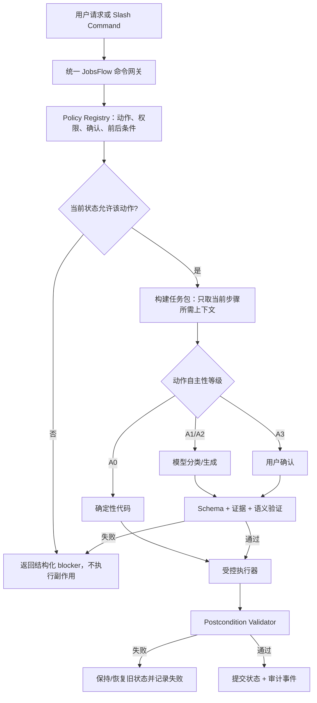

# JobsFlow SOP 与大模型自主性控制架构技术手册

**版本：** 1.0（实施设计稿）
**日期：** 2026-08-14
**适用对象：** 负责修改 JobsFlow 产品代码、命令、测试和文档的开发大模型或工程人员
**实施状态：** 2026-08-14 已落地 P0–P3 代码与测试（`tools/workflow/`）；P4 为合成合规夹具，尚未做双模型现场评测
**核心目标：** 将 JobsFlow 从“依靠执行模型阅读 Skill/手册并自觉遵守”升级为“业务 SOP 主导、代码控制副作用、模型在受限语义空间内自主工作”的受控 Agent 工作流，使能力相对有限的模型也能稳定地产出高质量结果。

---

## 1. 结论与设计立场

JobsFlow 的产品设想不是让大模型自由决定整条求职流程，而是：

> **产品拥有流程和业务规则；模型拥有受约束的语义判断与表达选择；用户拥有偏好、事实和高影响决策的最终确认权。**

因此，面向能力相对有限的模型，业务 SOP 不仅应当成体系，而且应当覆盖大多数基层、细致、一线和具体操作。以下内容原则上都应由产品明确规定：

- 必须读取哪些输入；
- 按什么顺序执行；
- 哪些状态下允许进入下一步；
- 哪些字段必须输出；
- 哪些内容不得声称；
- 哪些失败可以降级，哪些必须停止；
- 哪些操作需要用户确认；
- 哪些文件可以写、哪些不得覆盖；
- 完成后必须验证什么；
- 什么条件下才能宣称完成。

但“规则居多”不等于“把更多长文塞给模型”。如果关键规则只存在于 Skill、README、Slash Command 或长篇手册中，它仍然只是软约束。目标应当是把自然语言 SOP **编译**为：

1. 机器可读政策；
2. 固定输入/输出 schema；
3. 明确状态机；
4. 前置校验；
5. 受控执行入口；
6. 事后校验；
7. 审计事件；
8. 回归测试。

模型可以选择“怎样把正确的事做得更好”，但不能选择“是否遵守正确的事”。

---

## 2. 为什么详细 SOP 与模型自主性并不冲突

### 2.1 自主性应放在解空间，不应放在规则空间

同一岗位材料可能存在多种优秀写法，模型可以决定：

- 哪两项真实证据最能回答当前 JD；
- 如何把 10 条职责聚合成 3–5 个主题；
- 如何解释相邻经验的可迁移性；
- 哪些 bullet 前置、哪些删除；
- Cover Letter 如何在一页内形成自然论证。

但模型不应自行决定：

- 是否需要完整 JD；
- 是否读取 assessment、preflight 和事实节点；
- 是否可以把 `transferable` 写成 `direct`；
- 是否跳过招聘机构/实际雇主识别；
- 是否检查占位符、页数、文本层和旧文件；
- 是否在用户未确认时修改求职意向；
- 是否在用户未授权时清空或归档 fresh tab；
- WAF 后重试多少次、何时熔断、是否把 teaser 当 full JD。

前一组是“受约束创作与判断”，后一组是“产品政策与流程控制”。

### 2.2 低能力模型需要窄任务，不需要无限上下文

能力相对有限的模型表现不稳定，通常不是因为规则数量太多，而是因为：

- 一次任务同时要求理解过多目标；
- 规则分散在多份长文中；
- 输出没有枚举、schema 和固定顺序；
- 模型需要自己发现缺失输入；
- 模型既规划、又生成、又校验、又执行副作用；
- 失败后系统只是重试，没有缩小问题。

正确方案不是删掉详细 SOP，而是把 SOP 拆成小型、可验证的工作单：

```text
系统选择当前动作
→ 只提取此动作相关的政策片段
→ 生成结构化任务包
→ 模型只完成一个窄语义任务
→ schema/事实/状态校验
→ 通过后才进入下一状态
```

模型每次只需要理解当前决策，不需要背诵整个系统。

### 2.3 目标不是消灭模型差异，而是限制差异的影响范围

不同模型仍会在措辞、主题聚类、证据优先级和公司简介上有质量差异。产品需要保证的是：

- 较弱模型不能跳过关键工序；
- 较弱模型不能扩大候选人事实；
- 较弱模型不能直接执行未授权副作用；
- 无法判断时必须输出 `review/unknown`，不能静默猜测；
- 无效输出只影响当前语义任务，不污染长期状态；
- 更强模型提高质量，但不改变安全边界。

---

## 3. 五类规则及其所有者

实施者必须先把现有手册、Skill、命令和代码中的规则归入以下五类。不得把所有规则都笼统称为“提示词”。

| 类别 | 所有者 | 示例 | 正确落点 |
|---|---|---|---|
| 产品不变量 | 产品代码 | 不自动投递；产品/私人隔离；未确认不得归档 | 代码 gate、状态机、测试 |
| 业务 SOP | 产品代码 + 结构化任务 | 材料输入顺序、职责矩阵、跨材料对账 | orchestrator、schema、validator、任务包 |
| 基础设施策略 | 产品代码 | JobsDB 缓存、WAF 重试、熔断、预算、降级 | portal 模块、配置、状态文件、测试 |
| 用户偏好/事实 | 用户确认的私人状态 | 求职意向、扫描深度、薪资、画像上沿 | preview/confirm、私人配置、版本记录 |
| 模型判断 | 模型 | 主题聚类、证据排序、自然表达、公司简述 | 有界 prompt、枚举输出、语义审计 |

### 3.1 判断一条规则是否必须进入代码

满足以下任一条件，就不能只放在手册里：

- 使用“必须”“不得”“只有……才”“除非用户确认”“任何情况下”；
- 错误会删除、覆盖、清空、发送、归档或公开数据；
- 错误会改变用户长期配置或历史状态；
- 错误会导致虚假候选人事实进入外发材料；
- 错误会导致漏扫、重复请求、错误入表或把浅层数据冒充深评；
- 需要跨多个模型、命令或会话保持一致；
- 可以被确定性代码验证；
- 用户无法在结果表面轻易发现错误。

### 3.2 模型可自主决定的判断标准

只有同时满足以下条件，才适合交给模型：

- 输入事实和允许范围已经明确；
- 存在多个同样合规的合理答案；
- 无法用简单确定性规则穷举；
- 输出可以被 schema、证据或第二道语义门检查；
- 失败不会直接造成不可逆副作用；
- `unknown/review` 是允许的诚实结果。

---

## 4. 约束等级与自主性等级

### 4.1 规范用语

- **MUST：** 不满足即阻断状态转换；
- **MUST NOT：** 一旦发生即失败，不能被综合分数抵消；
- **SHOULD：** 默认执行，偏离时必须记录理由；
- **MAY：** 在政策允许范围内由模型或用户选择。

### 4.2 自主性等级

每个动作必须标注一个自主性等级：

| 等级 | 含义 | 执行者 | 示例 |
|---|---|---|---|
| A0 | 纯确定性，不允许模型判断 | 代码 | 哈希、页数、是否存在文件、是否已确认 |
| A1 | 有限分类，只能输出枚举 | 模型 + validator | direct/transferable/gap/forbidden；publisher type |
| A2 | 受约束生成或排序 | 模型 + evidence gate | JD 主题、证据优先级、CV/CL 文案 |
| A3 | 高影响用户决策 | 用户 | 是否申请明显 stretch 岗、薪资口径、是否归档 |

模型不得把 A0/A3 动作自行提升为 A1/A2。能力更强的模型也不获得更高权限。

---

## 5. 三个当前重点领域的归类

### 5.1 两份材料手册属于什么

以下两份私人试运行手册是业务 SOP 的权威输入：

- `JobSearch_2026/03_Applications/ATS_LLMO高质量岗位定制材料执行手册_低能力模型版_2026-08-13.md`
- `JobSearch_2026/03_Applications/求职材料生成质量技术手册_2026-08-13.md`

它们不是单纯的“写作建议”。其中大部分内容属于产品应强制落实的业务规则，但强制方式不同。

#### 5.1.1 必须由代码直接拥有的规则

- 输入是否存在、版本和哈希是否一致；
- 完整 JD、画像、assessment、preflight、role/publisher/employer contract 是否齐备；
- stale 输入不得进入当前制作轮次；
- 用户未回答的硬门槛不得视为通过；
- `direct/transferable/stretch/unsupported` 和 `Direct/Transferable/Gap/Forbidden` 必须使用枚举；
- 每个 claim 必须绑定 evidence ID；
- forbidden claim 不得进入外发文本；
- CV、CL、Email 中实体、数字、语言、资格和职位必须一致；
- required attachment 必须真实存在；
- 文件名不得使用招聘机构名称；
- 占位符、残句、旧公司、旧职位、内部评分和系统字段必须扫描；
- CV/CL 页数、PDF 文本层、DOCX/PDF 当前性必须验证；
- P0/P1 未清零不得标记 `apply_ready`；
- 生成、审计、PDF 和发布状态必须分开。

#### 5.1.2 由模型判断、但必须结构化和验证的规则

- 从 JD 拆出 duties、requirements 和 anchors；
- 为职责赋权并聚成 3–5 个岗位主题；
- 判断某证据是 Direct、Transferable 还是 Gap；
- 制定本岗位相对其他岗位的差异化计划；
- 在证据边界内排序 CV 内容；
- 选择 CL 的 1–2 个最强匹配点；
- 解释相邻经验如何迁移；
- 在有来源时写简短公司/行业匹配语句；
- 在篇幅预算内自然表达。

上述任务不是自由写作。每项输出必须满足固定 schema、引用 evidence IDs，并可由内容审计 Agent 检查。

#### 5.1.3 必须由用户决定的事项

- 对关键职责为 Gap 的岗位是否仍申请；
- 薪资、工作权、到岗、资格等未确认事实；
- 是否采用有争议的职位简称或人工 override；
- 是否接受 stretch 定位；
- 最终是否投递。

#### 5.1.4 手册的运行时使用方式

不得要求每次材料制作都让模型从头读取两份 700 多行手册，并期待其记住所有细节。应建立“手册编译层”：

```text
两份权威手册
→ 规则登记表（稳定 rule_id）
→ 当前动作所需规则选择
→ materials_task_packet.json
→ 模型执行窄任务
→ validator/auditor 按同一 rule_id 验收
```

完整手册用于设计、审计、版本升级和疑难回溯；日常运行使用高密度、任务相关的机器契约。

### 5.2 JobsDB 检索问题属于什么

JobsDB 的以下规则属于基础设施策略和产品可靠性规则，不属于模型自主空间：

- URL JD 缓存优先；
- 缓存命中不消耗网络预算；
- 浏览器并发、请求间隔和单轮请求上限；
- WAF/Challenge/429/timeout/empty 的稳定分类；
- WAF/Challenge 不进行密集自动重试；
- 单 URL 最大尝试次数；
- 门户级连续失败计数和熔断；
- 冷却时间、`Retry-After` 和恢复探测；
- Challenge 不得覆盖 last-known-good session；
- 熔断后保留列表页信息并降级为 `teaser/paste_needed/provisional_needs_jd`；
- 其他门户继续运行；
- 定制材料缺完整 JD 时请求用户粘贴；
- 不自动破解验证码、不进行指纹伪装或代理轮换规避站点控制。

这些参数可以配置，但配置值来自产品默认、私人已确认配置或显式诊断命令，不得由执行模型临场改变。

模型在 JobsDB 流程中只负责：

- 向用户解释结构化运行结果；
- 在 `provisional_needs_jd` 时建议查看岗位或补充 JD；
- 在熔断长期存在时建议显式人工恢复；
- 根据用户目标选择是否值得为某一岗位补 JD。

私人试运行可以采用“首个 WAF 即熔断”，产品默认可以采用“连续两个 Challenge 熔断”。二者必须由配置和状态明确区分，不能依赖模型回忆本轮采用哪种策略。

### 5.3 fresh_24h 保留与归档属于什么

“每日刷新进入 fresh_24h；除非用户明确要求归档，否则不归档”是 A0/A3 规则：

- 默认保留属于 A0 产品不变量；
- 是否归档属于 A3 用户决策；
- 模型不得凭“表格太多”“已经提升到主表”或“通常应清理”自行归档。

当前 `tools/fresh_24h/promote_fresh_to_main.py` 的危险点是：默认提升后清空 fresh，只有传入 `--keep-fresh-rows` 才保留。实施时必须反转默认值。

目标语义应为：

```text
promote = 复制/合并到主表，同时保留 fresh
archive = 单独的显式动作，需要用户确认
clear = archive 成功后的内部实现，不得作为普通命令默认副作用
```

---

## 6. 目标控制架构



### 6.1 核心原则

1. **单一高层入口：** Agent 正常情况下只调用统一命令网关；
2. **底层也安全：** 即使误调用底层脚本，其默认值也不得违反产品不变量；
3. **先决策、后副作用：** 模型输出先成为 proposal，不直接写核心状态；
4. **状态先于文本：** 系统根据状态决定下一步，不让模型凭聊天记忆推断；
5. **完成由 validator 定义：** 模型不能仅凭自然语言宣布完成；
6. **失败显式化：** 未知、降级、待确认和阻断必须有稳定状态；
7. **写入可审计：** 每次状态变化记录 actor、输入摘要、rule_id、前后状态和结果；
8. **私人数据隔离：** 政策和 schema 在产品线，候选人事实和运行状态在私人 workspace。

---

## 7. 建议模块与小型接口

不得把新规则全部塞进 `fresh_24h_scan.py`、`push_to_gsheet.py`、`two_pass_score.py` 或一个超级提示词。建议建立深模块，把复杂行为隐藏在小型 interface 后面。

建议目录：

```text
tools/workflow/
├── contracts.py          # ActionRequest/Decision/Result/Event 数据契约
├── policy.py             # 读取并裁决业务政策
├── state.py              # 状态读取、合法转移、原子提交
├── confirmation.py       # 两阶段确认和过期检查
├── orchestrator.py       # 唯一流程编排入口
├── task_packet.py        # 按动作生成最小上下文包
├── postconditions.py     # 事后业务校验
├── audit_log.py          # 私人审计事件
├── policies.json         # 无个人数据的产品政策登记表
└── adapters/
    ├── scan.py
    ├── push.py
    ├── materials.py
    ├── apply.py
    └── archive.py
```

建议统一入口：

```bash
python3 -m tools.workflow scan --mode temp
python3 -m tools.workflow push
python3 -m tools.workflow materials --job-id C0-001
python3 -m tools.workflow apply --job-id C0-001
python3 -m tools.workflow archive preview --fresh-title fresh_24h_2026-08-14
python3 -m tools.workflow archive confirm --proposal-id <id>
```

Slash Command 只负责把用户意图映射到这些高层动作，不再复制长流程。

### 7.1 建议的核心数据契约

```json
{
  "action": "archive_fresh",
  "autonomy_level": "A3",
  "actor": "user|agent|system",
  "target": "fresh_24h_2026-08-14",
  "policy_version": "2026-08-14",
  "confirmation_id": null,
  "preconditions": [],
  "requested_at": "ISO-8601"
}
```

政策裁决输出：

```json
{
  "allowed": false,
  "rule_ids": ["FRESH-ARCHIVE-001"],
  "requires_confirmation": true,
  "blockers": ["explicit_user_confirmation_missing"],
  "next_action": "create_archive_preview"
}
```

执行结果：

```json
{
  "status": "succeeded|blocked|failed|degraded",
  "before_state": "promoted_retained",
  "after_state": "archived",
  "side_effects": [],
  "postconditions": [],
  "event_id": "..."
}
```

---

## 8. 业务政策登记表

实施者必须建立稳定 `rule_id`，让代码、任务包、错误信息、审计报告和测试引用同一条规则。

建议字段：

| 字段 | 含义 |
|---|---|
| `rule_id` | 稳定标识，不随措辞变化 |
| `domain` | scan/push/materials/apply/archive/intent/portal |
| `statement` | 简洁规范语句 |
| `level` | MUST/MUST_NOT/SHOULD/MAY |
| `autonomy` | A0/A1/A2/A3 |
| `enforcement` | code/schema/model_validator/user_confirmation/postcondition |
| `preconditions` | 执行前必须满足的状态 |
| `allowed_transitions` | 合法状态变化 |
| `failure_status` | blocked/failed/degraded/review |
| `override_policy` | none/user_confirmed/diagnostic_only |
| `tests` | 对应测试标识 |

首批至少登记：

| Rule ID | 规则摘要 | 强制方式 |
|---|---|---|
| `FRESH-001` | 扫描/推送写入 fresh，不自动归档 | 代码默认值 + postcondition |
| `FRESH-002` | 未经用户明确确认不得清空 fresh | 两阶段确认 + gate |
| `SCAN-001` | 扫描不得自动生成材料 | orchestrator 状态机 |
| `PUSH-001` | semantic pending 默认阻止正式 push | precondition gate |
| `INTENT-001` | 意向修改必须 preview/confirm | digest + confirmation |
| `MAT-001` | 材料生成必须读取当前输入契约 | task packet + hash gate |
| `MAT-002` | claim 必须绑定 evidence ID | schema + validator |
| `MAT-003` | transferable 不得升级为 direct | semantic lint + audit |
| `MAT-004` | P0/P1 未清零不得 apply_ready | state transition gate |
| `PORTAL-JDB-001` | JobsDB 缓存优先 | portal executor |
| `PORTAL-JDB-002` | WAF/Challenge 不密集自动重试 | retry policy + test |
| `PORTAL-JDB-003` | 达阈值后门户级熔断并安全降级 | circuit state machine |
| `APPLY-001` | `/apply` 不自动提交 | hard invariant |

---

## 9. 工作流状态机

### 9.1 扫描与 fresh 生命周期

```text
scan_requested
→ scan_running
→ scan_completed | scan_degraded | scan_failed
→ scored
→ semantic_pending | semantic_ready
→ pushed_to_fresh
→ promoted_retained
→ archive_pending_confirmation
→ archived
```

强制规则：

- `scan_failed` 不得推进成功刷新游标；
- `semantic_pending` 不得正式 push，除非显式诊断 override；
- `promoted_retained` 必须保留 fresh 原数据；
- 只有 `archive_pending_confirmation` 且确认摘要未过期，才允许进入 `archived`；
- archive 的目标 tab、行数、内容摘要在 preview 与 confirm 之间发生变化时，确认失效；
- 归档完成后必须验证归档副本和目标状态，再允许清空活动视图；
- 普通 promote、push、scan 都不得调用 clear。

### 9.2 材料生命周期

```text
job_selected
→ package_ready
→ inputs_frozen
→ preflight_pending | preflight_ready
→ planning_pending
→ plan_validated
→ drafting
→ content_audit_pending
→ content_passed
→ pdf_generated
→ format_passed
→ apply_ready
→ user_confirmed_for_submission
```

输入哈希变化必须使所有下游状态失效，而不是继续沿用旧 `passed`。

建议失效关系：

| 输入变化 | 至少失效 |
|---|---|
| JD | assessment、plan、draft、audit、PDF、apply_ready |
| 画像/事实节点 | assessment、claim ledger、draft、audit、PDF |
| preflight answer | preflight、相关文案、audit、PDF |
| role/employer override | 文件名、CV/CL/Email、manifest、audit、PDF |
| 正文手工修改 | content audit、PDF、format gate |
| 模板/版式修改 | PDF、format gate |

---

## 10. 模型任务包设计

### 10.1 原则

每个模型调用必须有一个明确任务包，包含完成当前任务所需的最小上下文。不得把整个私人 workspace、所有历史材料和完整手册无差别注入。

任务包必须包含：

- `task_type`；
- `rule_ids`；
- `input_hashes`；
- 当前任务所需 JD 片段；
- 允许使用的 evidence nodes；
- forbidden claims；
- 枚举和 schema；
- 允许的自主性范围；
- 明确的停止条件；
- 输出上限和篇幅预算；
- 示例只用于结构，不得作为候选人事实；
- validation errors 的稳定代码。

### 10.2 材料规划任务包示例

```json
{
  "task_type": "materials_plan",
  "autonomy_level": "A1_A2",
  "rule_ids": ["MAT-001", "MAT-002", "MAT-003"],
  "job": {"role_primary": "...", "employer_status": "..."},
  "jd": {"hash": "...", "duties": [], "requirements": []},
  "assessment": {"revision": 3, "strengths": [], "gaps": []},
  "evidence_nodes": [],
  "forbidden_claims": [],
  "required_output_schema": "materials_plan.v1",
  "stop_if": ["stale_input", "missing_full_jd", "unresolved_hard_requirement"]
}
```

### 10.3 低能力模型的失败处理

如果模型：

- 输出非 JSON；
- 漏字段；
- 使用未知 evidence ID；
- 把 Forbidden 标成 Direct；
- 引入任务包外的候选人事实；
- 未覆盖全部高权重 duty；

系统必须返回窄化错误，只要求修复错误字段。不得自动把无效输出当作中性结果，也不得无限重跑整项任务。

建议最多：一次 schema repair + 一次语义 repair；仍失败则进入 `needs_capable_model_or_human_review`。

---

## 11. 前置与事后校验

### 11.1 每个副作用的通用前置检查

- 当前状态允许该动作；
- 输入文件存在且 hash 与 proposal 一致；
- 用户确认仍有效；
- 动作目标精确，不使用宽泛路径或未解析变量；
- 无更高优先级 blocker；
- 幂等键未重复提交；
- 操作不会修改产品/私人边界外的数据。

### 11.2 每个副作用的通用事后检查

- 实际状态与目标状态一致；
- 写入数量、目标和摘要符合执行计划；
- 不允许改变的对象没有变化；
- 产物可重新读取和解析；
- 旧状态或备份仍可恢复；
- audit event 已写入；
- 失败时未错误标记 success。

### 11.3 fresh 归档的专用 postcondition

未确认归档时：

```text
fresh_before_row_count == fresh_after_row_count
fresh_before_digest == fresh_after_digest（允许新增批次时除外）
archive_event_count == 0
```

确认归档时：

```text
archive_copy_exists == true
archive_copy_digest == preview_digest
main_merge_verified == true（如本动作包含提升）
fresh_active_state == archived_or_header_only
confirmed_target == actual_target
```

### 11.4 材料的专用 postcondition

```text
all_claim_ids_resolve == true
forbidden_claim_count == 0
cross_material_conflicts == 0
required_files_exist == true
docx_pdf_hash_current == true
content_p0_p1_count == 0
cv_page_count == policy
cl_page_count == policy
pdf_text_extractable == true
```

---

## 12. 两阶段确认设计

所有 A3 或破坏性动作使用 `preview → confirm`，不得把普通聊天中的“可以”“好的”自动解释为对任意目标的永久授权。

确认提案至少包含：

```json
{
  "proposal_id": "...",
  "action": "archive_fresh",
  "target": "fresh_24h_2026-08-14",
  "target_digest": "...",
  "row_count": 51,
  "effects": ["copy_to_archive", "clear_active_rows"],
  "created_at": "...",
  "expires_at": "...",
  "status": "pending_confirmation"
}
```

confirm 时必须检查：

- proposal 仍为 pending；
- action 和 target 精确一致；
- digest/row_count 未发生意外变化；
- 未过期；
- 未被使用过；
- 用户确认发生在 proposal 创建之后。

确认只授权这一项动作，不自动授权后续归档、删除、发送或投递。

---

## 13. 审计事件与可观测性

建议私人运行目录：

```text
JobSearch_2026/02_Tracker/workflow/
├── state.json
├── events.jsonl
├── confirmations/
├── task_packets/
└── validation_reports/
```

每个事件至少记录：

- `event_id`、时间和 workflow run id；
- actor 类型和模型名称（可得时）；
- action；
- policy version 和命中的 rule IDs；
- 输入 hash，不复制敏感正文；
- before/after state；
- 是否需要和取得用户确认；
- side effects；
- validation 结果；
- failure/degraded reason；
- next_action。

审计日志不得写入 cookie、storage state、凭据、完整简历或完整 JD。

---

## 14. 实施优先级

### P0：修复危险默认值与不可逆副作用

1. `promote_fresh_to_main.py` 默认保留 fresh；
2. 移除普通 promote 的隐式 clear；
3. 新建独立 archive preview/confirm 动作；
4. 为未确认归档补前置和事后测试；
5. 确认 `/scan`、`/push`、`/materials`、`/apply` 不会隐式触发 archive/send/delete。

### P1：建立规则登记表和统一状态契约

1. 盘点所有 `MUST/MUST NOT/除非确认`；
2. 分配稳定 rule IDs；
3. 建立 workflow state 和原子事件记录；
4. 让 Slash Command 调用统一网关；
5. 底层脚本改为安全默认且返回机器可读结果。

### P2：编译两份材料手册

1. 将材料输入、枚举、claim ledger、职责矩阵、差异化计划和审计输出定义成 schema；
2. 根据当前状态生成 task packet；
3. 生成模型只能消费 task packet，不自行在私人目录漫游找事实；
4. 把 P0/P1 规则接入 deterministic validator；
5. 把 direct/transferable、动词/对象/范围和动机真实性接入独立语义审计；
6. `apply_ready` 改为由状态机计算，不能由模型直接写 true。

### P3：统一 JobsDB 运行策略

1. 将请求预算、单次尝试、Challenge 阈值、冷却和降级配置化；
2. 私人试运行和产品默认使用同一 schema、不同已声明配置；
3. 模型不能通过临时参数绕过熔断，诊断 override 必须显式记录；
4. 将 portal 状态纳入统一 run result；
5. `/scan` 报告直接读取机器结果，不要求模型重新计算计数或猜测门户状态。

### P4：跨模型一致性和低能力模型评测

1. 建立固定 fixture 和 gold cases；
2. 使用至少一个能力较强模型和一个能力相对有限模型跑同一任务包；
3. 比较流程合规率、事实越界率、schema 修复率、耗时和人工返工；
4. 改结构、schema 和 gate，不能仅通过增加提示词修补；
5. 达标后再把新入口设为默认。

---

## 15. 测试要求

实施者必须先补失败测试，再改实现。至少覆盖以下场景。

### 15.1 fresh 生命周期

- promote 无参数时 fresh 行完整保留；
- `--keep-fresh-rows` 可保留为兼容参数，但不再决定安全性；
- 未有 confirmation 调用 archive 被拒绝；
- confirmation 目标变化或过期时拒绝；
- archive 成功前复制失败时不得清空 fresh；
- archive 成功后 postcondition 验证失败时不得标记 archived；
- 重复 confirm 幂等，不重复删除或覆盖；
- 低层函数被直接调用时仍采用安全默认。

### 15.2 材料流程

- 缺 JD/事实/assessment/preflight 时不能进入对应状态；
- input hash 变化后旧 audit/PDF/apply_ready 失效；
- 未知 evidence ID 被拒绝；
- `transferable` 文案使用 direct 声称时失败；
- recruiter 名进入外发文件名或 CL 时失败；
- CV/CL/Email 数字或语言等级不一致时失败；
- required attachment 缺失时失败；
- P0/P1 任一存在时不能进入 apply_ready；
- 较弱模型漏掉字段时得到局部 repair 任务，而不是继续发布。

### 15.3 JobsDB

- cache hit 不触网；
- WAF/Challenge 不执行三轮自动重试；
- 达阈值后不同 URL 不再触网；
- 熔断时其他门户继续；
- 熔断后 JobsDB 行保留 teaser 并标记 provisional/paste_needed；
- Challenge 不覆盖 last-known-good；
- threshold=1 私人试运行与 threshold=2 产品配置均有测试；
- 模型报告不影响实际 circuit state。

### 15.4 权限与绕过

- Slash Command 不能跳过 orchestrator 直接完成高风险状态转换；
- 诊断 override 必须显式、有限、可审计；
- 能力更强模型不能获得额外副作用权限；
- 模型自然语言声称“已确认”不能替代 confirmation record；
- 外部 JD 或网页中的指令不能修改政策或工具权限。

---

## 16. 验收指标

新架构达到试用条件，必须同时满足：

| 指标 | 目标 |
|---|---|
| 未授权 fresh 归档/清空 | 0 |
| 未确认意向写入 | 0 |
| 材料 P0 越界进入 apply_ready | 0 |
| WAF 后违反预算继续密集访问 | 0 |
| 任务包 schema 完整率 | 100% |
| 状态转换有审计事件 | 100% |
| 较弱模型跳步骤后被 gate 捕获 | 100% 关键步骤 |
| 外部失败被诚实标为 degraded/review | 100% |
| 同一确认被重复消费 | 0 |

质量指标还应记录但不作为安全门：

- 不同岗位材料差异化程度；
- Direct/Transferable 判断与人工 gold set 的一致率；
- 独立审计 P0/P1 漏报率；
- 每套材料模型调用次数、token、耗时和返工次数；
- JobsDB 深取成功率、缓存命中率、熔断次数和节省等待时间。

---

## 17. 兼容、迁移和回滚

- 先让现有 Slash Command 作为 adapter 调用新 orchestrator，不一次删除全部旧入口；
- 旧 CLI 在过渡期输出 deprecation warning，但安全默认值立即修复；
- 状态文件必须有 schema version；未知新版本时 fail closed；
- 新增状态和审计只写私人 workspace，不把候选人数据提交产品仓库；
- 迁移脚本只读旧状态、生成预览，用户确认后才写新状态；
- 每个阶段独立提交，至少按 P0、P1、P2、P3 拆分；
- 回滚新 orchestrator 时不得恢复危险默认值、未确认归档或材料事实越界；
- 不得使用 `git reset --hard` 或覆盖用户现有私人材料；
- 实施时保护当前脏工作树，不提交与本手册无关的修改。

---

## 18. 明确禁止的实现方式

- 只增加一份更长的 Skill 或 system prompt；
- 每次运行都把全部手册、全部历史材料和全部 tracker 注入模型；
- 依靠模型在自然语言中声明“我已检查”；
- 用第二个 Agent 替代确定性 gate；
- 用综合评分抵消 P0/P1；
- 让模型直接修改核心状态或写 `apply_ready=true`；
- 把归档、清空、发送、投递做成默认副作用；
- 让底层脚本保持危险默认，仅要求 Slash Command 记得传安全参数；
- 模型输出非法时静默采用 3.0、中性值、空列表或上一次不匹配结果；
- 无限重试模型、门户或 PDF 转换来掩盖结构问题；
- 为跨模型一致性牺牲事实准确性或用户最终决定权。

---

## 19. 给实施大模型的强制工作指令

实施大模型必须按以下顺序工作：

1. 完整读取本文、`AGENTS.md`、`CLAUDE.md`、`docs/system_rules.md`、`docs/adr/001-workflow-boundaries.md`；
2. 完整读取两份材料手册和 JobsDB 可靠性手册；
3. 盘点当前代码中所有有副作用的入口，特别是 scan cursor、push、promote/clear、intent confirm、materials/apply；
4. 生成规则落地矩阵，逐条标记“文档、代码、schema、状态机、前置门、事后门、测试”的现状；
5. 不假设文档已经被代码实现，必须找到调用链和测试证据；
6. 先为 P0 危险默认值建立失败测试，再做最小修复；
7. 不把所有流程重写成一个大类或大脚本；使用本文定义的模块 seam 和小型 interface；
8. 每完成一个阶段运行窄测试，最后运行完整 pytest、门户 CLI 测试、security guards 和 public release checks；
9. 不运行真实大规模门户扫描，不改变用户 refresh cursor，不连接/修改真实 Google Sheet，除非用户另行明确授权；
10. 不改写或提交 `JobSearch_2026` 私人数据；如需 fixture，使用合成数据；
11. 不碰当前工作树中与本任务无关的修改；
12. 交付时列出修改文件、规则矩阵、测试结果、兼容影响、仍为软约束的规则和下一阶段建议。

实施过程中若发现本文与当前用户明确指令冲突，以用户本轮明确指令为准；若与隐私、安全或不可逆操作规则冲突，停止并报告，不得自行放宽。

---

## 20. 完成定义

本次架构升级不能以“新增了 workflow 文档”或“补了 prompt”作为完成。只有以下条件同时满足，才可以宣称完成：

- 关键业务规则有稳定 rule ID 和唯一权威来源；
- 高风险动作有合法状态转换、前置门和事后门；
- fresh 默认保留，归档必须显式确认；
- 两份材料手册的关键规则已转成 schema、task packet 和 validator/auditor 契约；
- JobsDB 网络行为由确定性策略控制，模型不能临场改变；
- Slash Command 使用统一高层入口；
- 底层脚本即使被误调用也采用安全默认；
- 较弱模型跳步、漏字段或越界时被系统阻断并得到窄化修复任务；
- 每个关键状态变化有私人审计事件；
- 合成端到端测试证明 `/scan → /push → /materials → /apply` 不依赖模型记忆隐含步骤；
- 产品/私人隔离、事实边界和不自动投递原则保持不变。

最终目标不是把 JobsFlow 变成完全没有自主性的流水线，而是形成这样的关系：

> **SOP 决定边界、顺序和完成标准；代码保证 SOP 无法被轻易绕过；模型在边界内完成语义理解和高质量表达；用户控制事实、偏好和高影响选择。**
